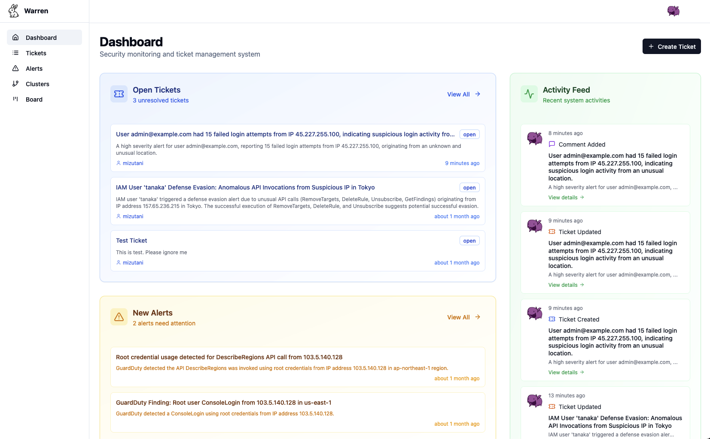
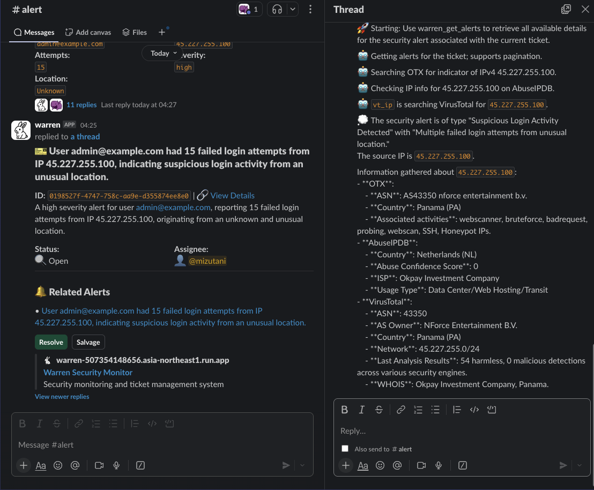

# Warren

AI-powered security alert management that reduces noise and accelerates response time

<p align="center">
  
</p>

## What is Warren?

Warren is an open-source security alert management system that automates the tedious parts of alert triage. It ingests alerts from your existing tools, enriches them with AI and threat intelligence, and helps you focus on actual incidents instead of noise.

**Key technical features:**
- **Webhook-based ingestion**: Simple HTTP endpoints for any alert source (no agents required)
- **Policy-driven processing**: Write Rego policies to filter and transform alerts before they hit your queue
- **Vector similarity clustering**: Automatically groups related alerts using embeddings
- **LLM-powered analysis**: Uses LLM (Large Language Model) to generate human-readable summaries and extract IOCs
- **API-first design**: GraphQL API for custom integrations, Slack bot for notifications
- **Flexible deployment**: Runs anywhere from local Docker to Kubernetes, with optional cloud services

## Key Features

### Alert Processing Pipeline
- **Parallel enrichment** queries multiple threat intel APIs (OTX, VirusTotal, AbuseIPDB, etc.)
- **Structured extraction** - LLM extracts IOCs, TTPs, and risk indicators into queryable fields
- **React-based Web UI** - real-time dashboard, ticket management, and WebSocket-based AI chat
- **DBSCAN clustering** with cosine similarity on Gemini embeddings (256-dim vectors)

<p align="center">
  
  <br>
  <em>Dashboard view: Similar alerts are automatically grouped using DBSCAN clustering on embedding vectors</em>
</p>

The Web UI provides:
- **Alert timeline view** with clustering visualization
- **Ticket workflow** - create, assign, and track incident tickets
- **Interactive AI chat** - ask questions about specific alerts in natural language
- **Export capabilities** - download alert data as JSONL for further analysis

### Integration Architecture
- **Webhook receivers** at `/hooks/alert/{raw,sns,pubsub}/{schema}` for any alert format
  - **Asynchronous processing support** - Return HTTP 200 immediately while processing alerts in background
- **Slack bot** with interactive components (buttons, modals) for ticket management
- **GraphQL API** with DataLoader for efficient queries and real-time subscriptions

<p align="center">
  
  <br>
  <em>Slack integration: Alerts arrive with threat intel enrichment and one-click ticket creation</em>
</p>

### Policy Engine
- **Rego-based alert policies** - transform, filter, or multiply alerts before processing
- **Authorization policies** - fine-grained access control with environment context
- **Test framework** - validate policies with sample inputs before deployment

Example policy to filter and enrich alerts:
```rego
package alert.cloudtrail

alert contains {
    "title": sprintf("Suspicious AWS Activity: %s", [event.eventName]),
    "description": sprintf("%s in %s by %s", [
        event.eventName,
        event.awsRegion,
        event.userIdentity.userName
    ]),
    "attrs": [
        {
            "key": "event_name",
            "value": event.eventName,
            "link": ""
        },
        {
            "key": "source_ip",
            "value": event.sourceIPAddress,
            "link": sprintf("https://www.abuseipdb.com/check/%s", [event.sourceIPAddress])
        }
    ]
} if {
    event := input.Records[_]
    event.eventName in ["DeleteBucket", "StopLogging", "DeleteTrail"]
    not ignore
}

# Ignore events from trusted IPs
ignore if {
    event := input.Records[_]
    event.sourceIPAddress in ["10.0.0.1", "192.168.1.100"]
}
```

## Quick Start

```bash
# Prerequisites
export PROJECT_ID=your-gcp-project
gcloud auth application-default login
gcloud services enable aiplatform.googleapis.com --project=$PROJECT_ID

# Run Warren (in-memory storage, no auth)
docker run -d -p 8080:8080 \
  -v ~/.config/gcloud:/home/nonroot/.config/gcloud:ro \
  -e WARREN_GEMINI_PROJECT_ID=$PROJECT_ID \
  -e WARREN_NO_AUTHENTICATION=true \
  -e WARREN_NO_AUTHORIZATION=true \
  -e WARREN_ADDR=0.0.0.0:8080 \
  ghcr.io/secmon-lab/warren:latest serve

# Send test alert
curl -X POST http://localhost:8080/hooks/alert/raw/test \
  -H "Content-Type: application/json" \
  -d '{"title": "SSH brute force", "source_ip": "45.227.255.100"}'
```

Visit http://localhost:8080 to access the dashboard.

[Full Getting Started Guide →](./doc/getting_started.md)

## Integrations

- **Alert Sources**: AWS GuardDuty, Suricata, SIEM webhooks, Custom apps
- **Threat Intel**: VirusTotal, AlienVault OTX, URLScan, Shodan, AbuseIPDB
- **Collaboration**: Slack (native bot), GraphQL API, REST webhooks
- **Infrastructure**: Google Cloud (Vertex AI, Firestore), Docker, Kubernetes

## Documentation

- [Getting Started](./doc/getting_started.md) - Your first alert in 5 minutes
- [User Guide](./doc/user_guide.md) - Day-to-day operations
- [Policy Guide](./doc/policy.md) - Custom detection rules
- [Architecture](./doc/model.md) - Technical deep dive

## Contributing

We welcome contributions! See [Contributing Guide](./doc/contributing.md)

## License

Apache 2.0 License

