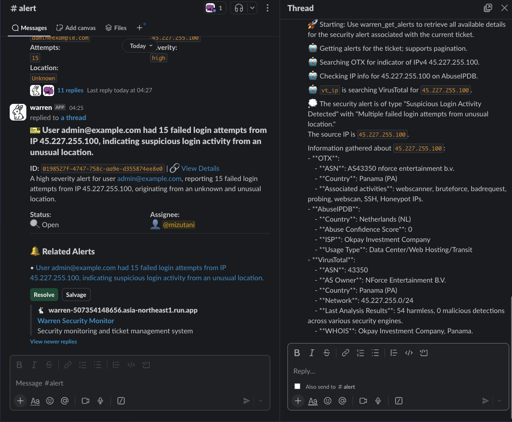
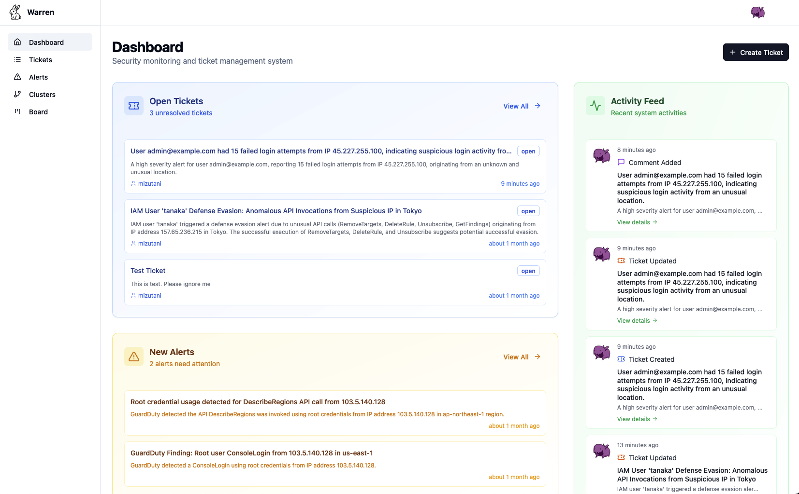

# Warren

AI-native security alert management — not just AI-assisted, but built from the ground up to let AI agents perform the work of security analysts.

<p align="center">
  
</p>

## Why Warren?

Security teams drown in alerts. Analysts spend most of their time on repetitive triage — classifying, enriching, and closing alerts that turn out to be noise.

Warren addresses this by **decomposing the security analyst's workflow into discrete, composable stages** and rebuilding each stage as an AI-native process:

| Traditional Workflow | Warren's Approach |
|---|---|
| Analyst manually classifies incoming alerts | **Policies + AI enrichment** automatically transform, contextualize, and classify alerts |
| Analyst queries threat intel tools one by one | **AI agents orchestrate tool calls** across multiple sources in parallel |
| Analyst writes up findings from memory | **LLM synthesizes** enrichment results into structured conclusions |
| Knowledge lives in individual analysts' heads | **Agent memory system** accumulates and scores organizational knowledge |
| Triage decisions are inconsistent across shifts | **Triage policies** enforce standardized decision criteria |

This is not a generic AI agent with security tools bolted on. Warren is purpose-built for the security operations domain, with specialized context engineering, memory architecture, and workflow orchestration designed for how alert investigation actually works.

## How It Works

### Slack-Based Multi-Agent Investigation

Warren operates as a **Slack-native multi-agent system**. When an alert arrives, it is posted to a Slack channel with AI-generated analysis. Team members interact with Warren directly in Slack threads — `@warren` triggers an investigation agent that can delegate work to specialized sub-agents in parallel:

```
User asks @warren in Slack thread
  └─ Orchestrator Agent
       ├─ BigQuery Agent  → query audit logs, access patterns
       ├─ Falcon Agent    → pull EDR endpoint data from CrowdStrike
       ├─ Slack Agent     → search related conversations
       └─ Direct tools    → VirusTotal, OTX, Shodan, AbuseIPDB, URLScan
```

Each sub-agent autonomously decides what queries to run and how to interpret results. Real-time progress traces in the Slack thread show what the agent is doing as it works.

<p align="center">
  
</p>

### Agent Memory

Agents **learn from every investigation**. After each execution, an LLM-driven reflection extracts claims — self-contained facts like *"SSH brute force from this CIDR range has been seen weekly and is always noise"*. Claims are stored with vector embeddings and quality scores that evolve over time: helpful memories get boosted, harmful ones get penalized and eventually pruned.

The result: agents get better at their job over time. Common false positive patterns are recognized faster. Environment-specific knowledge accumulates without manual curation.

### Alert Processing Pipeline

Before alerts reach Slack, they pass through a policy-driven pipeline:

1. **Ingest Policy** (Rego/OPA) — transform and filter raw webhook data
2. **Metadata Generation** — LLM fills missing titles and descriptions
3. **Enrichment** — parallel multi-agent investigation (same system as above)
4. **Triage Policy** (Rego/OPA) — publish, archive, or decline

Policies are written in **Rego** and deployable without code changes. Alerts arrive in Slack already investigated and contextualized.

### Web UI & Continuous Improvement

A React-based dashboard for alert management, ticket workflow with structured findings, and interactive AI chat.

<p align="center">
  
</p>

Each investigation feeds back into the system: **agent memory** captures patterns, a **tag system** (`#refine`, `#double-check`) flags cases needing policy updates, and **resolved tickets** with structured conclusions build organizational knowledge that benefits the entire team.

## Quick Start

```bash
# Prerequisites
export PROJECT_ID=your-gcp-project
gcloud auth application-default login
gcloud services enable aiplatform.googleapis.com --project=$PROJECT_ID

# Run Warren (in-memory storage, no auth)
docker run -d -p 8080:8080 \
  -v ~/.config/gcloud:/home/nonroot/.config/gcloud:ro \
  -e WARREN_GEMINI_PROJECT_ID=$PROJECT_ID \
  -e WARREN_NO_AUTHENTICATION=true \
  -e WARREN_NO_AUTHORIZATION=true \
  -e WARREN_ADDR=127.0.0.1:8080 \
  ghcr.io/secmon-lab/warren:latest serve

# Send test alert
curl -X POST http://localhost:8080/hooks/alert/raw/test \
  -H "Content-Type: application/json" \
  -d '{"title": "SSH brute force", "source_ip": "45.227.255.100"}'
```

Visit http://127.0.0.1:8080 to access the dashboard.

## Integrations

| Category | Services |
|---|---|
| **Alert Sources** | AWS GuardDuty, Suricata, SIEM webhooks, any JSON via raw webhook |
| **Threat Intel** | VirusTotal, AlienVault OTX, URLScan, Shodan, AbuseIPDB |
| **Data Sources** | BigQuery, Slack message search, CrowdStrike Falcon |
| **Collaboration** | Slack (native bot with interactive components), GraphQL API |
| **Infrastructure** | Google Cloud (Vertex AI, Firestore), Docker, Kubernetes |

## Documentation

- [Getting Started](./doc/getting_started.md) - Your first alert in 5 minutes
- [User Guide](./doc/user_guide.md) - Day-to-day operations
- [Policy Guide](./doc/policy.md) - Custom detection and enrichment rules
- [Architecture](./doc/model.md) - Technical deep dive

## Contributing

We welcome contributions! See [Contributing Guide](./doc/contributing.md)

## License

Apache 2.0 License
