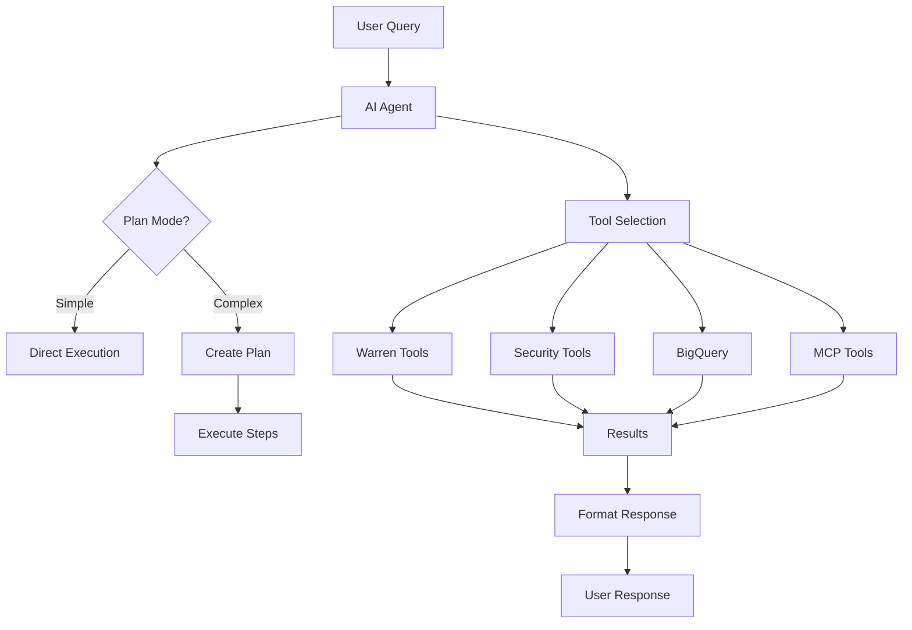

# Warren AI Agent Guide

Warren's AI Agent provides an intelligent chat interface for investigating security incidents using natural language. The agent can automatically execute various security tools, analyze data, and provide actionable insights.

## Overview

The AI Agent serves as your security analysis assistant, capable of:
- Analyzing alerts and tickets using multiple threat intelligence sources
- Executing complex investigations through simple commands
- Finding patterns and similar incidents in historical data
- Updating ticket findings based on analysis results

### Architecture



## Accessing the Chat Interface

### Web UI

1. Navigate to a ticket's detail page
2. Click the **"Chat with Agent"** button
3. Enter your query in the chat interface
4. View responses and tool executions in real-time

### Command Line Interface

Interactive mode:
```bash
warren chat --ticket-id ticket-12345678-abcd-efgh-ijkl-123456789012
```

Single query mode:
```bash
warren chat --ticket-id ticket-12345678-abcd-efgh-ijkl-123456789012 \
  --query "Analyze all IPs in this ticket"
```

### Options

- `--ticket-id`: Required. The ticket to analyze
- `--query`: Single query to execute (non-interactive)
- `--list`: Show previous chat sessions
- `--session-id`: Continue a specific session
- `--slack`: Post responses to Slack thread
- `--dry-run`: Test without making changes
- `--lang`: Response language (en, ja, etc.)

## Available Tools

### Warren Base Tools

These tools integrate directly with Warren's data:

#### `warren_get_alerts`
Retrieves alerts associated with the current ticket.
```
"Show me all alerts in this ticket"
"Get the latest 5 alerts"
```

#### `warren_find_nearest_ticket`
Finds similar tickets based on AI embeddings.
```
"Find similar incidents"
"Show me tickets like this one"
```

#### `warren_search_tickets_by_words`
Searches tickets using keywords or natural language.
```
"Search for tickets mentioning ransomware"
"Find all tickets with IP 192.168.1.100"
```

#### `warren_update_finding`
Updates the ticket's finding with analysis results.
```
"Update finding with critical severity"
"Set this as a true positive incident"
```

### Security Intelligence Tools

#### VirusTotal Integration
- `vt_ip_lookup`: Check IP reputation
- `vt_domain_lookup`: Analyze domains
- `vt_hash_lookup`: Check file hashes
- `vt_url_lookup`: Scan URLs

Example:
```
"Check if IP 192.168.1.100 is malicious"
"Analyze the domain suspicious-site.com"
```

#### AbuseIPDB & Abuse.ch
- `abusech_ip_lookup`: Check IP abuse reports
- `abusech_domain_lookup`: Domain abuse database
- `abuseipdb_check`: IP reputation scoring

Example:
```
"Is this IP reported for abuse?"
"Check abuse history for these domains"
```

#### Shodan
- `shodan_host_lookup`: Internet device information
- `shodan_search`: Search exposed services

Example:
```
"What services are running on this IP?"
"Search for similar exposed systems"
```

#### URLScan
- `urlscan_search`: Search URL scan results
- `urlscan_submit`: Submit URL for scanning

Example:
```
"Scan this suspicious URL"
"Find previous scans of this domain"
```

#### OTX (Open Threat Exchange)
- `otx_ip_lookup`: IP threat intelligence
- `otx_domain_lookup`: Domain intelligence
- `otx_hostname_lookup`: Hostname analysis
- `otx_file_lookup`: File hash intelligence
- `otx_url_lookup`: URL threat data

Example:
```
"Get threat intelligence for this IP"
"Check if this file hash is known malware"
```

### BigQuery Tools

For analyzing security logs and historical data:

#### `bigquery_query`
Execute SQL queries on your security data.
```
"Query login attempts from this IP in the last 30 days"
"Show me all events from this user yesterday"
```

#### `bigquery_list_datasets`
List available BigQuery datasets.
```
"What datasets are available?"
"Show me the security log tables"
```

#### `bigquery_query_by_runbook`
Execute predefined SQL templates.
```
"Run the suspicious login detection query"
"Execute the data exfiltration runbook"
```

## MCP (Model Context Protocol) Integration

Warren supports extending capabilities through MCP:

### What is MCP?

MCP allows Warren to connect to external tool servers that provide additional capabilities. These can be:
- Remote services (via HTTP/SSE)
- Local executables
- Custom integrations

### Configuring MCP

Create a YAML configuration file:

```yaml
# mcp-config.yaml
servers:
  - name: "custom-intel"
    type: "sse"
    url: "https://intel-api.example.com/mcp"
    headers:
      Authorization: "Bearer YOUR_API_KEY"
    
  - name: "local-scanner"
    type: "stdio"
    command: "/usr/local/bin/scanner-mcp"
    args: ["--mode", "mcp"]
```

Use with Warren:
```bash
warren chat --ticket-id TICKET_ID --mcp-config mcp-config.yaml
```

### Available MCP Types

1. **SSE (Server-Sent Events)**
   - Real-time streaming tools
   - Remote API integrations

2. **HTTP**
   - RESTful tool endpoints
   - Request-response patterns

3. **STDIO**
   - Local executables
   - Command-line tools wrapped as MCP

## Using the Chat Interface

### Basic Commands

Simple questions about the ticket:
```
"Summarize this incident"
"What's the severity of these alerts?"
"When did this attack start?"
```

### Investigation Commands

Comprehensive analysis:
```
"Analyze all IPs and domains in this ticket"
"Check if any indicators are malicious"
"Find the attack pattern"
```

### Complex Investigations

Multi-step analysis with plan mode:
```
"Investigate this incident thoroughly:
1. Check all IPs against threat intel
2. Search for similar past incidents
3. Query logs for related activity
4. Summarize findings and recommend actions"
```

### Updating Tickets

Modify ticket information:
```
"Update the finding with high severity"
"Mark this as a false positive with explanation"
"Add recommendation to block these IPs"
```

## Plan Mode

For complex requests, the agent automatically enters plan mode:

```
User: Perform a complete investigation of this incident

Agent: I'll help you perform a complete investigation. Let me break this down:

📋 Creating plan...

### Investigation Plan
- [ ] Analyze alert indicators
- [ ] Check threat intelligence  
- [ ] Search historical data
- [ ] Summarize findings

⏳ Starting execution...

✅ [1/4] Analyzing alert indicators...
[Tool execution details]

✅ [2/4] Checking threat intelligence...
[Tool execution details]
```

Plan mode provides:
- Clear task breakdown
- Progress tracking
- Transparent execution
- Error handling

## Effective Prompts

### Be Specific
❌ "Check this"
✅ "Check if the source IP 192.168.1.100 is malicious"

### Provide Context
❌ "Find similar"
✅ "Find similar DDoS attacks from the last 30 days"

### Request Actions
❌ "This looks bad"
✅ "Update the finding with critical severity and recommend immediate IP blocking"

### Batch Operations
❌ Multiple separate queries
✅ "Analyze all IPs, domains, and file hashes in this ticket for threats"

## Advanced Usage

### Chaining Investigations

```
"First check if these IPs are malicious, then search our BigQuery logs 
for any successful connections from confirmed bad IPs"
```

### Custom Analysis

```
"Compare this incident with the one from last week (ticket-xxx) and 
identify common patterns"
```

### Automated Workflows

```
"Every time you find a malicious IP:
1. Check our logs for any connections
2. See if other tickets mention it
3. Add it to the finding summary"
```

## Slack Integration

When using `--slack` flag, the agent posts to the ticket's Slack thread:

```
💬 Agent: Starting investigation of suspicious IPs...

⚡ Executing: vt_ip_lookup
✅ IP 192.168.1.100 - Clean (0/87 detections)

⚡ Executing: shodan_host_lookup  
✅ Found open ports: 22, 80, 443

💬 Agent: Investigation complete. The IP appears to be a legitimate web server with standard ports.
```

## Best Practices

### 1. Start Broad, Then Focus
Begin with general analysis, then dive into specific concerns:
```
"Analyze this incident" → "Focus on the command injection attempts"
```

### 2. Verify Critical Findings
Double-check important results:
```
"The IP showed up as malicious in OTX. Check VirusTotal and AbuseIPDB too"
```

### 3. Document Thoroughly
Update findings with clear explanations:
```
"Update finding: Confirmed ransomware attack. Initial access via phishing email.
Recommendation: Isolate affected systems and begin incident response procedure."
```

### 4. Use Historical Context
Leverage past incidents:
```
"Compare with similar tickets to see if this is part of a campaign"
```

### 5. Automate Repetitive Tasks
Let the agent handle routine checks:
```
"For each alert, check all IPs and domains against threat intel"
```

## Troubleshooting

### "Tool not found"
- Verify tool name is correct
- Check if external API keys are configured
- Ensure MCP servers are running

### "No response from agent"
- Check ticket ID is valid
- Verify you have access to the ticket
- Check Warren logs for errors

### "Timeout errors"
- Complex queries may take time
- Consider breaking into smaller requests
- Check external service availability

### "Cannot update finding"
- Ensure you have write permissions
- Verify ticket is not archived
- Check the finding format

## Examples

### Example 1: Basic Threat Analysis
```
User: Check if any IPs in this ticket are malicious

Agent: I'll check all IPs in this ticket against threat intelligence sources.

[Executes vt_ip_lookup, otx_ip_lookup, abuseipdb_check for each IP]

Found 3 IPs in the alerts:
- 192.168.1.100: Clean across all sources
- 10.0.0.50: Internal IP, skipped
- 185.220.100.240: MALICIOUS - Listed in 45/87 VT engines, 
  OTX shows it's part of Tor exit nodes
```

### Example 2: Historical Pattern Search
```
User: Find similar SQL injection attacks in the past month

Agent: I'll search for SQL injection patterns in recent tickets.

[Executes warren_search_tickets_by_words with SQL injection keywords]
[Executes bigquery_query for web logs with SQL patterns]

Found 7 similar incidents:
- 5 tickets with SQL injection attempts
- All targeting the same /api/users endpoint  
- Coming from 3 different IP ranges
- Pattern suggests automated scanning tool
```

### Example 3: Incident Summary
```
User: Summarize this incident and update the finding

Agent: I'll analyze all alerts and create a comprehensive summary.

[Analyzes alerts, checks indicators, reviews patterns]

Summary: Coordinated brute force attack against SSH services across 
15 servers. Attack originated from known botnet IPs. No successful 
logins detected.

[Executes warren_update_finding]

✅ Updated ticket finding with High severity and summary.
```

## Language Support

The agent responds in your configured language:

```bash
# Japanese responses
warren chat --ticket-id TICKET_ID --lang ja

# Spanish responses  
warren chat --ticket-id TICKET_ID --lang es
```

Supported languages depend on the underlying LLM model.

## Token Usage

Monitor LLM token consumption:

```bash
# Dry run shows token estimates
warren chat --ticket-id TICKET_ID --dry-run

# Session info includes token counts
warren chat --list --ticket-id TICKET_ID
```

## Next Steps

1. **Explore Tools**: Try each tool category to understand capabilities
2. **Create Workflows**: Develop standard investigation patterns
3. **Configure MCP**: Add custom tools for your environment
4. **Share Knowledge**: Document useful prompts for your team