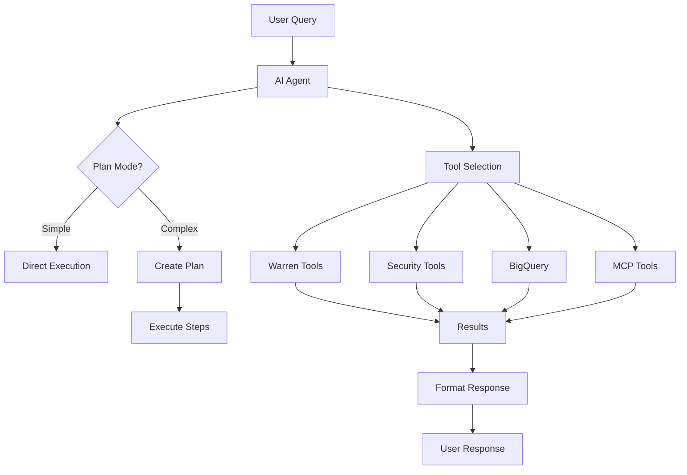

# Warren AI Agent Guide

Warren's AI Agent provides an intelligent command-line interface for investigating security incidents using natural language. The agent analyzes alerts within the context of a specific ticket, executing various security tools and providing actionable insights.

## Overview

The AI Agent serves as your security analysis assistant, capable of:
- Analyzing alerts bound to a specific ticket using threat intelligence sources
- Executing complex investigations through natural language commands
- Finding patterns and similar incidents in historical data
- Updating the ticket's findings based on analysis results

### Important Concept: Ticket Context

The AI Agent always operates within the context of a specific ticket. When you use the chat command, you must provide a ticket ID. The agent will:
- Access all alerts associated with that ticket
- Read the ticket's metadata and current findings
- Update the ticket's findings when requested
- Search for similar tickets based on the current ticket's content

This ticket-centric approach ensures that all AI analysis is properly tracked and associated with your investigation workflow.

### Architecture



## Using the Chat Interface

The AI Agent is accessed through the command-line interface. There is no Web UI integration at this time.

### Command Line Interface

#### Interactive mode:
```bash
warren chat --ticket-id ticket-12345678-abcd-efgh-ijkl-123456789012
```

This starts an interactive session where you can have a conversation with the agent about the specified ticket.

#### Single query mode:
```bash
warren chat --ticket-id ticket-12345678-abcd-efgh-ijkl-123456789012 \
  --query "Analyze all IPs in this ticket"
```

This executes a single query and exits, useful for automation or quick checks.

### Required Option

- `--ticket-id` or `-t`: The ticket ID to analyze (required)

### Optional Options

- `--query` or `-q`: Single query to execute (if not provided, starts interactive mode)

Additionally, all standard Warren configuration options are available (Firestore, LLM, Policy, Storage, MCP settings). See the [Configuration Reference](./configuration.md) for details.

## Tool Configuration

### Setting Up External Tool API Keys

Before using the security intelligence tools, you need to configure their API keys. Warren will gracefully skip tools without configured API keys and inform you when a tool is unavailable.

#### Configuration Methods

1. **Environment Variables** (Recommended for production):
```bash
export WARREN_VT_API_KEY="your-virustotal-api-key"
export WARREN_OTX_API_KEY="your-alienault-otx-key"
export WARREN_URLSCAN_API_KEY="your-urlscan-api-key"
export WARREN_SHODAN_API_KEY="your-shodan-api-key"
export WARREN_IPDB_API_KEY="your-abuseipdb-key"
export WARREN_ABUSECH_API_KEY="your-abusech-key"
```

2. **Command-line Flags** (For testing):
```bash
warren serve \
  --vt-api-key="your-virustotal-api-key" \
  --otx-api-key="your-otx-api-key" \
  --urlscan-api-key="your-urlscan-api-key" \
  --shodan-api-key="your-shodan-api-key" \
  --ipdb-api-key="your-abuseipdb-key" \
  --abusech-api-key="your-abusech-key"
```

3. **Google Secret Manager** (For Google Cloud deployments):
```bash
# Create secrets
echo -n "your-api-key" | gcloud secrets create vt-api-key --data-file=-

# Use in Cloud Run
gcloud run services update warren \
  --set-secrets="WARREN_VT_API_KEY=vt-api-key:latest"
```

#### Obtaining API Keys

- **VirusTotal**: Sign up at [virustotal.com](https://www.virustotal.com), go to API Key section
- **OTX**: Register at [otx.alienvault.com](https://otx.alienvault.com), find API key in settings
- **URLScan**: Create account at [urlscan.io](https://urlscan.io), API key in profile
- **Shodan**: Sign up at [shodan.io](https://www.shodan.io), API key in account settings
- **AbuseIPDB**: Register at [abuseipdb.com](https://www.abuseipdb.com), generate key in account

#### Default Behavior

- **Missing API Keys**: Tools without configured keys are automatically excluded from the available tool list
- **Failed API Calls**: Agent reports the error and continues with other tools
- **Rate Limits**: Agent respects rate limits and reports when limits are hit

When tools are not configured, they simply won't appear in the agent's available tools. The agent will use whatever tools are available to complete the requested analysis.

## Available Tools

### Warren Base Tools

These tools integrate directly with Warren's data and operate within the context of your current ticket:

#### `warren_get_alerts`
Retrieves all alerts that are bound to the current ticket.
```
"Show me all alerts in this ticket"
"What alerts are we investigating?"
```

#### `warren_find_nearest_ticket`
Finds similar tickets based on AI embeddings of the current ticket.
```
"Find similar incidents"
"Show me tickets like this one"
"Are there any related investigations?"
```

#### `warren_search_tickets_by_words`
Searches all tickets using keywords or natural language.
```
"Search for tickets mentioning ransomware"
"Find all tickets with IP 192.168.1.100"
"Show me other tickets from the same user"
```

#### `warren_update_finding`
Updates the current ticket's finding field with your analysis results.
```
"Update finding with critical severity"
"Set this as a true positive incident"
"Add investigation summary to findings"
```

#### `warren_get_ticket_comments`
Retrieves comments from the current ticket's Slack thread.
```
"Show me all comments on this ticket"
"What has the team discussed about this?"
"Get the latest Slack discussion"
```

### Security Intelligence Tools

#### VirusTotal Integration
- `vt_ip`: Check IP reputation
- `vt_domain`: Analyze domains
- `vt_file_hash`: Check file hashes
- `vt_url`: Scan URLs

Example:
```
"Check if IP 192.168.1.100 is malicious"
"Analyze the domain suspicious-site.com"
```

#### AbuseIPDB
- `ipdb_check`: IP reputation scoring and abuse reports

Example:
```
"Is this IP reported for abuse?"
"Check the reputation of 192.168.1.100"
```

#### Abuse.ch
- `abusech.bazaar.query`: Query malware samples and IoCs

Example:
```
"Search for this file hash in malware databases"
"Check if this hash is known malware"
```

#### Shodan
- `shodan_host`: Internet device information for specific IP
- `shodan_domain`: Search devices associated with a domain
- `shodan_search`: Search exposed services with queries

Example:
```
"What services are running on this IP?"
"Search for exposed MongoDB instances"
"Find all devices for example.com domain"
```

#### URLScan
- `urlscan_scan`: Submit and scan a URL

Example:
```
"Scan this suspicious URL"
"Analyze https://suspicious-site.com"
```

#### OTX (Open Threat Exchange)
- `otx_ipv4`: IPv4 address threat intelligence
- `otx_ipv6`: IPv6 address threat intelligence
- `otx_domain`: Domain threat intelligence
- `otx_hostname`: Hostname analysis
- `otx_file_hash`: File hash intelligence

Example:
```
"Get threat intelligence for this IP"
"Check if this file hash is known malware"
```

### BigQuery Tools

For analyzing security logs and historical data:

#### `bigquery_query`
Execute SQL queries on your security data.
```
"Query login attempts from this IP in the last 30 days"
"Show me all events from this user yesterday"
```

#### `bigquery_list_dataset`
List available BigQuery datasets.
```
"What datasets are available?"
"Show me the security log tables"
```

#### `bigquery_result`
Get results of a previously executed query.
```
"Show the results of query job-123"
"Get the output from the last query"
```

#### `bigquery_schema`
Get schema information for a table.
```
"Show me the schema for the events table"
"What columns are in the security_logs table?"
```

#### `bigquery_table_summary`
Get summary information about a table.
```
"Summarize the security_events table"
"How many rows are in the logs table?"
```

## MCP (Model Context Protocol) Integration

Warren supports extending capabilities through MCP:

### What is MCP?

MCP allows Warren to connect to external tool servers that provide additional capabilities. These can be:
- Remote services (via HTTP/SSE)
- Local executables
- Custom integrations

### Configuring MCP

Create a YAML configuration file:

```yaml
# mcp-config.yaml
servers:
  - name: "custom-intel"
    type: "sse"
    url: "https://intel-api.example.com/mcp"
    headers:
      Authorization: "Bearer YOUR_API_KEY"
    
  - name: "local-scanner"
    type: "stdio"
    command: "/usr/local/bin/scanner-mcp"
    args: ["--mode", "mcp"]
```

Use with Warren:
```bash
warren chat --ticket-id TICKET_ID --mcp-config mcp-config.yaml
```

### Available MCP Types

1. **SSE (Server-Sent Events)**
   - Real-time streaming tools
   - Remote API integrations

2. **HTTP**
   - RESTful tool endpoints
   - Request-response patterns

3. **STDIO**
   - Local executables
   - Command-line tools wrapped as MCP

## Using the Chat Interface

### Understanding Ticket Context

Before using commands, remember that the agent always works within the context of your specified ticket:
- All alerts referenced are those bound to the ticket
- Findings updates modify the current ticket
- Similarity searches compare against the current ticket
- The agent cannot access alerts or data from other tickets unless explicitly searching

### Basic Commands

Simple questions about the current ticket:
```
"Summarize this incident"
"What's the severity of these alerts?"
"When did this attack start?"
"How many alerts are in this ticket?"
```

### Investigation Commands

Comprehensive analysis of the ticket's alerts:
```
"Analyze all IPs and domains in this ticket"
"Check if any indicators are malicious"
"Find the attack pattern in these alerts"
"What services are affected?"
```

### Complex Investigations

Multi-step analysis with plan mode:
```
"Investigate this incident thoroughly:
1. Check all IPs against threat intel
2. Search for similar past incidents
3. Query logs for related activity
4. Summarize findings and recommend actions"
```

### Updating the Current Ticket

Modify the ticket's finding field:
```
"Update the finding with high severity"
"Mark this as a false positive with explanation"
"Add recommendation to block these IPs"
"Summarize the investigation results in the finding"
```

## Plan Mode

For complex requests, the agent automatically enters plan mode:

```
User: Perform a complete investigation of this incident

Agent: I'll help you perform a complete investigation. Let me break this down:

📋 Creating plan...

### Investigation Plan
- [ ] Analyze alert indicators
- [ ] Check threat intelligence  
- [ ] Search historical data
- [ ] Summarize findings

⏳ Starting execution...

✅ [1/4] Analyzing alert indicators...
[Tool execution details]

✅ [2/4] Checking threat intelligence...
[Tool execution details]
```

Plan mode provides:
- Clear task breakdown
- Progress tracking
- Transparent execution
- Error handling

## Effective Prompts

### Be Specific
❌ "Check this"
✅ "Check if the source IP 192.168.1.100 is malicious"

### Provide Context
❌ "Find similar"
✅ "Find similar DDoS attacks from the last 30 days"

### Request Actions
❌ "This looks bad"
✅ "Update the finding with critical severity and recommend immediate IP blocking"

### Batch Operations
❌ Multiple separate queries
✅ "Analyze all IPs, domains, and file hashes in this ticket for threats"

## Advanced Usage

### Chaining Investigations

```
"First check if these IPs are malicious, then search our BigQuery logs 
for any successful connections from confirmed bad IPs"
```

### Custom Analysis

```
"Compare this incident with the one from last week (ticket-xxx) and 
identify common patterns"
```

### Automated Workflows

```
"Every time you find a malicious IP:
1. Check our logs for any connections
2. See if other tickets mention it
3. Add it to the finding summary"
```

## Slack Integration

The chat command itself does not post to Slack. However, when you update the ticket's findings using the agent, those updates will be reflected in:
- The ticket's finding field in the database
- The Web UI when viewing the ticket
- Any subsequent Slack messages about the ticket will show the updated findings

To share your agent analysis with the team, use the `warren_update_finding` tool to save your conclusions to the ticket.

## Best Practices

### 1. Start Broad, Then Focus
Begin with general analysis, then dive into specific concerns:
```
"Analyze this incident" → "Focus on the command injection attempts"
```

### 2. Verify Critical Findings
Double-check important results:
```
"The IP showed up as malicious in OTX. Check VirusTotal and AbuseIPDB too"
```

### 3. Document Thoroughly
Update findings with clear explanations:
```
"Update finding: Confirmed ransomware attack. Initial access via phishing email.
Recommendation: Isolate affected systems and begin incident response procedure."
```

### 4. Use Historical Context
Leverage past incidents:
```
"Compare with similar tickets to see if this is part of a campaign"
```

### 5. Automate Repetitive Tasks
Let the agent handle routine checks:
```
"For each alert, check all IPs and domains against threat intel"
```

## Troubleshooting

### "Tool not found"
- Verify tool name is correct
- Check if external API keys are configured
- Ensure MCP servers are running

### "No response from agent"
- Check ticket ID is valid
- Verify you have access to the ticket
- Check Warren logs for errors

### "Timeout errors"
- Complex queries may take time
- Consider breaking into smaller requests
- Check external service availability

### "Cannot update finding"
- Ensure you have write permissions
- Verify ticket is not archived
- Check the finding format

## Examples

### Example 1: Basic Threat Analysis
```
User: Check if any IPs in this ticket are malicious

Agent: I'll analyze all IPs found in the alerts bound to ticket ticket-12345...

[Executes vt_ip, otx_ipv4, ipdb_check for each IP]

Found 3 IPs in this ticket's alerts:
- 192.168.1.100: Clean across all sources
- 10.0.0.50: Internal IP, skipped
- 185.220.100.240: MALICIOUS - Listed in 45/87 VT engines, 
  OTX shows it's part of Tor exit nodes
```

### Example 2: Historical Pattern Search
```
User: Find similar SQL injection attacks in the past month

Agent: I'll search for SQL injection patterns in recent tickets.

[Executes warren_search_tickets_by_words with SQL injection keywords]
[Executes bigquery_query for web logs with SQL patterns]

Found 7 similar incidents:
- 5 tickets with SQL injection attempts
- All targeting the same /api/users endpoint  
- Coming from 3 different IP ranges
- Pattern suggests automated scanning tool
```

### Example 3: Incident Summary
```
User: Summarize this incident and update the finding

Agent: I'll analyze all alerts in this ticket and create a comprehensive summary.

[Analyzes ticket's alerts, checks indicators, reviews patterns]

Based on the 23 alerts in this ticket:
- Attack type: Coordinated brute force against SSH services
- Affected systems: 15 servers in production environment
- Attack source: Known botnet IPs (confirmed via threat intel)
- Impact: No successful logins detected in logs

[Executes warren_update_finding]

✅ Updated ticket's finding field with High severity classification and investigation summary.
```

## Language Support

The agent responds in the language configured at the global level:

```bash
# Set language globally (affects all content generation)
# You can use any word to specify language
export WARREN_LANG=ja  # Japanese
export WARREN_LANG=日本語 # Japanese
export WARREN_LANG=es  # Spanish
export WARREN_LANG=en  # English (default)

warren chat --ticket-id TICKET_ID
```

Supported languages depend on the underlying LLM model (Gemini or Claude).

## Next Steps

1. **Explore Tools**: Try each tool category to understand capabilities
2. **Create Workflows**: Develop standard investigation patterns
3. **Configure MCP**: Add custom tools for your environment
4. **Share Knowledge**: Document useful prompts for your team