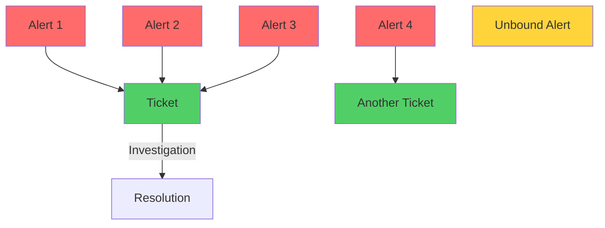
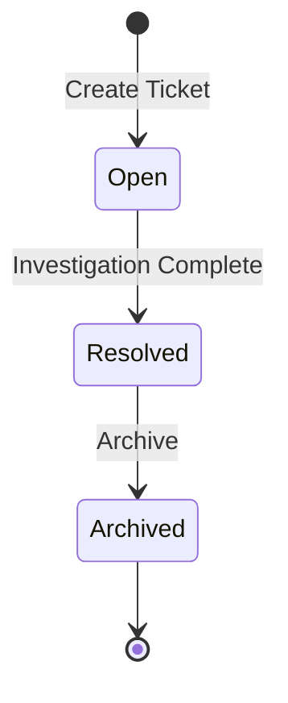
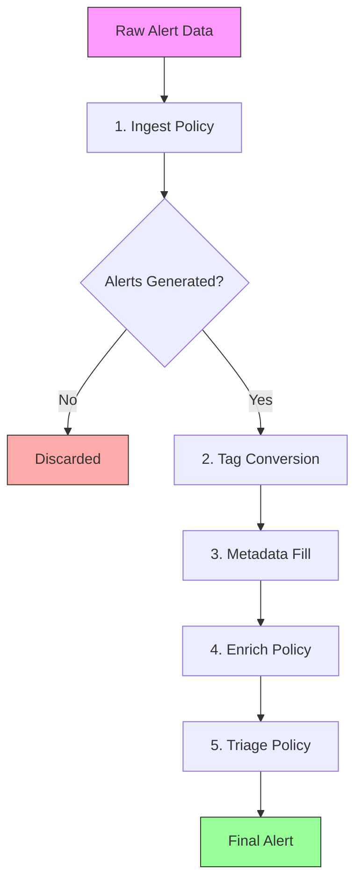

# Core Concepts

This document explains the fundamental data models and processing pipeline that power Warren.

## Alert and Ticket

Warren operates on two fundamental concepts:

- **Alert**: An individual security event from integrated security devices, monitoring systems, and security services.
- **Ticket**: A container for investigating and resolving one or more related alerts.

Even when alerts are detected individually, they often represent a single underlying incident — sometimes involving dozens or hundreds of alerts. Responding to each alert individually would exhaust security analysts.

In Warren, alerts are simply events, and tickets are the unit for response. Alerts determined to represent the same incident can be grouped into a ticket. The system can also suggest related alerts, allowing analysts to bind them as appropriate.



### Alert Model

An Alert represents a single security event:

| Field | Description |
|-------|-------------|
| `id` | Unique identifier (UUID) |
| `ticket_id` | Associated ticket (can be empty) |
| `schema` | Type of alert (e.g., "guardduty", "custom") |
| `data` | Raw alert data from source system |
| `title` | Human-readable title |
| `description` | Detailed description |
| `attributes` | Key-value pairs extracted from alert data |
| `tags` | Classification tags (e.g., "security", "critical") |
| `embedding` | Semantic embedding vector for similarity search |

Alerts are **immutable** — once created, their data is never modified. Each alert can belong to at most one ticket.

### Ticket Model

A Ticket tracks investigation progress:

| Field | Description |
|-------|-------------|
| `id` | Unique identifier |
| `status` | Current status (Open, Resolved, Archived) |
| `conclusion` | Final determination when resolved |
| `finding` | Structured investigation results (severity, summary, reason, recommendation) |
| `assignee` | Assigned analyst |

#### Ticket Lifecycle



#### Ticket Conclusions

When resolving a ticket, analysts select a conclusion:

- **Intended**: Expected behavior, not a security issue
- **Unaffected**: Alert was accurate but system not compromised
- **False Positive**: Alert triggered incorrectly
- **True Positive**: Confirmed security incident
- **Escalated**: Requires higher-level response

### Alert-Ticket Relationships

- One ticket can contain multiple alerts
- Each alert can belong to at most one ticket
- Alerts without tickets are "unbound"
- Once bound, alerts cannot be moved to different tickets

## Alert Processing Pipeline

Warren processes alerts through a multi-stage pipeline that evaluates policies, enriches data, and determines final disposition.



### Stage 1: Ingest Policy

Transforms raw webhook payloads into Alert objects using Rego policies.

- **Policy Package**: `package ingest.{schema_name}`
- **Input**: Raw JSON from webhook
- **Output**: Zero or more Alert objects
- **If missing**: Creates default alert with raw data

### Stage 2: Tag Conversion

Converts tag names in alert metadata to tag IDs for database storage. Tags are created automatically if they don't exist.

### Stage 3: Metadata Generation

Fills missing titles and descriptions using LLM (Vertex AI Gemini).

- Only runs if title or description is empty
- Generates 256-dimensional semantic embeddings for similarity search

### Stage 4: Enrich Policy

Executes enrichment tasks using LLM based on Rego policies.

- **Policy Package**: `package enrich.{schema_name}`
- **Task Types**: Query (simple LLM queries) and Agent (multi-step operations with tools)
- **If missing**: Returns empty results

### Stage 5: Triage Policy

Applies final metadata and determines how the alert should be published.

- **Policy Package**: `package triage`
- **Publish Types**:
  - `"alert"` (default): Full alert processing with ticket creation
  - `"notice"`: Simple notification without ticket
  - `"discard"`: Drop alert silently
- **If missing**: Uses default publish type ("alert")

### Graceful Degradation

The pipeline continues even when policies are missing — alerts are never lost due to missing configuration.

### Event Notification

The pipeline emits events at each stage for real-time monitoring via Slack threads or console output.

## Embeddings and Similarity

Each alert has a 256-dimensional embedding vector generated by AI, enabling:

- **Similarity Search**: Find alerts with similar patterns
- **Clustering**: Automatically group related alerts
- **Deduplication**: Identify duplicate or near-duplicate alerts

### Alert Similarity and Grouping

Warren groups related alerts using cosine similarity of their embedding vectors. Similar alerts can be:

- **Bound to a ticket** via the Salvage feature, which finds unbound alerts similar to a ticket's existing alerts
- **Listed together** for review, helping analysts identify patterns and related incidents

Practical uses:
1. **Alert Storm Management**: Quickly bind dozens of similar alerts to a single ticket
2. **Pattern Recognition**: Identify related alerts across different sources
3. **Bulk Operations**: Create tickets from groups of related alerts

## Tags

Tags provide classification for alerts and tickets using string labels.

- Auto-created when first referenced
- Alerts receive tags via policies; tickets inherit tags from bound alerts
- Tag operations: rename, delete, filter

## Knowledge

Knowledge is organizational security expertise that informs AI analysis. See [Knowledge Management](./operation/knowledge.md) for details.

## Experimental Features

### Refine

The `refine` feature periodically reviews and organizes Warren's operational state:

1. **Open Ticket Review** — Reviews all open tickets and posts follow-up messages when tickets appear stagnant
2. **Unbound Alert Consolidation** — Groups unbound alerts sharing a common cause and proposes ticket creation via Slack

#### How It Works

**Open Ticket Review**: For each open ticket, Warren collects metadata, linked alerts, and comment history, then asks the LLM whether a follow-up is needed. Follow-up messages are posted to the ticket's Slack thread.

**Unbound Alert Consolidation** runs in three phases:
1. **Summarize** — Each unbound alert is analyzed by the LLM to extract key features
2. **Consolidate** — All summaries are grouped by likely common cause
3. **Propose** — For each group, a Slack message is posted with a **Create Ticket** button

#### Usage

CLI (suitable for cron scheduling):
```bash
warren refine \
  --gemini-project-id <GCP_PROJECT_ID> \
  --firestore-project-id <GCP_PROJECT_ID> \
  --slack-oauth-token <SLACK_TOKEN> \
  --slack-channel-name <CHANNEL_NAME>
```

Slack command:
```
@warren refine
```

Limitations:
- Unbound alert processing is capped at 100 alerts per run
- Each consolidation group contains 2-10 alerts

### Agent Memory

Warren's AI agents can learn from previous investigations through agent memory:

- **Quality Scoring**: Memories rated from -10 (harmful) to +10 (helpful)
- **Adaptive Search**: Re-ranks memories by similarity (50%) + quality (30%) + recency (20%)
- **LLM Feedback**: Automatically evaluates memory usefulness after each agent execution
- **Conservative Pruning**: Strict deletion criteria to preserve valuable memories

Agent memory is enabled automatically for sub-agents (BigQuery, Falcon, Slack). Memories are scoped per agent and accumulate over time.
