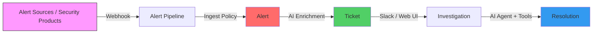
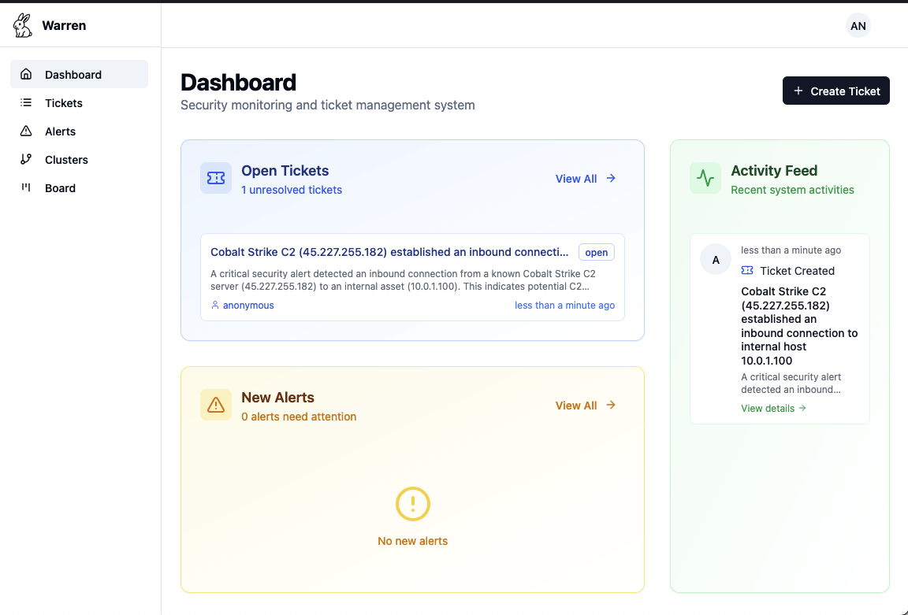

# Getting Started with Warren

Welcome to Warren! This guide helps you get Warren up and running in 5 minutes using Docker.

## Warren at a Glance

Warren is an AI-powered security alert management platform. Here's how it works:



**Key Concepts:**
- **Alert**: A security event from your monitoring systems
- **Ticket**: A container for investigating one or more related alerts
- **Policy**: Rego rules that transform, enrich, and triage alerts
- **Agent**: AI assistant that analyzes alerts using threat intelligence tools

**What's Required:**
- **Vertex AI (Gemini)**: Required — powers AI analysis and metadata generation
- **Firestore**: Required for production — stores alerts, tickets, and knowledge (in-memory for quick start)
- **Slack**: Optional — enables team collaboration and real-time notifications
- **Threat Intelligence APIs**: Optional — VirusTotal, OTX, Shodan, etc.

## Prerequisites

- **Docker**: [Docker Desktop](https://www.docker.com/products/docker-desktop/)
- **Google Cloud Account**: [Create a free account](https://cloud.google.com/free) if needed
- **gcloud CLI**: [Installation guide](https://cloud.google.com/sdk/docs/install)

## Quick Start

### Step 1: Google Cloud Setup (2 minutes)

```bash
export PROJECT_ID="your-project-id"

# Authenticate
gcloud auth application-default login

# Enable Vertex AI API
gcloud services enable aiplatform.googleapis.com --project=$PROJECT_ID
```

### Step 2: Run Warren with Docker (1 minute)

```bash
cat > warren.env << EOF
WARREN_GEMINI_PROJECT_ID=your-project-id
WARREN_GEMINI_LOCATION=us-central1
WARREN_NO_AUTHENTICATION=true
WARREN_NO_AUTHORIZATION=true
WARREN_ADDR=0.0.0.0:8080
EOF

sed -i.bak "s/your-project-id/$PROJECT_ID/g" warren.env && rm warren.env.bak

docker run -d \
  --name warren \
  -p 8080:8080 \
  -v ~/.config/gcloud:/home/nonroot/.config/gcloud:ro \
  --env-file warren.env \
  ghcr.io/secmon-lab/warren:latest serve

docker logs warren
```

Warren is now running at http://localhost:8080

> **Building locally**: If the Docker image is not available:
> ```bash
> git clone https://github.com/secmon-lab/warren.git && cd warren
> docker build -t warren:local .
> ```

### Step 3: Send Your First Alert (1 minute)

```bash
curl -X POST http://localhost:8080/hooks/alert/raw/test \
  -H "Content-Type: application/json" \
  -d '{
    "title": "Malicious IP Communication Detected",
    "description": "Outbound connection to known C2 server detected",
    "severity": "critical",
    "source_ip": "45.227.255.182",
    "destination_ip": "10.0.1.100"
  }'
```

### Step 4: Explore the Web UI (1 minute)

Open http://localhost:8080 to see:

1. **Alerts**: View the security alert you just sent
2. **Create a Ticket**: Select an alert and click "Create Ticket"
3. **AI Analysis**: In ticket details, click "Chat" and try:
   ```
   Analyze IP 45.227.255.182 using available tools
   ```



## What's Next?

You've successfully set up Warren and analyzed your first alert. Choose your path:

### For Security Analysts
1. [Alert Investigation Guide](./operation/alert-investigation.md) — Learn Slack, Web UI, and CLI workflows
2. [Knowledge Management](./operation/knowledge.md) — Capture organizational expertise

### For System Administrators
1. [GCP Deployment](./deployment/gcp.md) — Production deployment with Firestore, Cloud Run
2. [Slack Integration](./deployment/slack.md) — Team collaboration setup
3. [Configuration Reference](./reference/configuration.md) — All settings and environment variables

### For Policy Authors
1. [Policy Guide](./operation/policy.md) — Write Rego policies for alert processing
2. [Core Concepts](./concepts.md) — Understand alerts, tickets, and the pipeline

## Troubleshooting

**Docker container exits immediately**
```bash
docker logs warren
gcloud auth application-default login
```

**"Project not found" error**
```bash
gcloud config get-value project
gcloud config set project YOUR_PROJECT_ID
```

**API not enabled**
```bash
gcloud services enable aiplatform.googleapis.com
```

## Clean Up

```bash
docker stop warren && docker rm warren
rm warren.env
```
