# Getting Started with Warren

## What is Warren?

Warren is an AI-powered security alert management platform designed to transform how security teams handle and respond to alerts. By combining intelligent alert processing, collaborative workflows, and powerful AI analysis, Warren helps security teams:

- **Reduce Alert Fatigue**: Automatically group similar alerts and filter noise using customizable policies
- **Accelerate Investigation**: AI-powered analysis provides instant context and threat intelligence
- **Improve Collaboration**: Native Slack integration enables team-wide visibility and communication
- **Maintain Knowledge**: Every investigation is tracked, creating a searchable knowledge base

### Core Architecture

```mermaid
graph LR
    A[Security Tools] -->|Alerts| B[Warren]
    B --> C[AI Processing]
    C --> D[Alert Clustering]
    D --> E[Ticket Creation]
    E --> F[Slack Notifications]
    E --> G[Web UI]
    
    H[Security Analyst] --> F
    H --> G
    
    style B fill:#51cf66
    style C fill:#4285f4
    style F fill:#4a154b
```



## Prerequisites

Before using Warren, ensure you have:

- **Access Requirements**:
  - Warren Web UI URL (provided by your administrator)
  - Slack workspace with Warren bot installed
  - Login credentials (typically your Slack account)

- **Basic Understanding**:
  - Security alert concepts
  - Incident response workflows
  - Basic Slack usage

## Your First Alert

Let's walk through processing your first security alert in Warren.

### Step 1: Receive an Alert

When a security event is detected, Warren automatically:
1. Receives the alert from your security tools
2. Evaluates it against configured policies
3. Enriches it with AI-generated metadata
4. Posts it to your designated Slack channel

You'll see something like this in Slack:

```
❗ Suspicious Login Activity Detected
Multiple failed login attempts from unusual location
————————————————
*ID:* `alert-12345678-abcd-efgh-ijkl-123456789012`
*Schema:* `guardduty`
*Ack:* ⏳
————————————————
*severity:* medium
*source_ip:* 192.168.1.100
*region:* us-east-1

[Acknowledge] [Bind to ticket]
```

### Step 2: Review the Alert

The alert message shows:
- Alert title and description (AI-enhanced)
- Unique alert ID and schema type
- Acknowledgment status (⏳ for unbound, ✅ for bound)
- Key attributes extracted from the alert
- Action buttons for processing

### Step 3: Create a Ticket

If the alert requires investigation:

1. Click **[Acknowledge]** button to create a ticket immediately
   - This creates a ticket with AI-generated title and description
   - The alert status changes from ⏳ to ✅

2. Or click **[Bind to ticket]** to add to an existing ticket:
   - A modal appears showing recent tickets
   - Select from dropdown or enter ticket ID manually
   - Click **Bind** to associate the alert

### Step 4: Investigate

After ticket creation, you'll see a ticket message in Slack:

```
🎫 Suspicious Login Activity Investigation
*ID:* `ticket-87654321-dcba-hgfe-lkji-210987654321` | 🔗 View Details
Multiple failed login attempts detected from unusual location requiring investigation

*Status:*
🔍 Open
*Assignee:*
👤 Not assigned
————————————————
🔔 Related Alerts
• Suspicious Login Activity Detected
————————————————

[Resolve] [Salvage]
```

You can now:
- Click **🔗 View Details** to open in Web UI
- Collaborate in the Slack thread
- Click **[Resolve]** to close with conclusion
- Click **[Salvage]** to find similar unbound alerts

## Creating Your First Ticket

### From Multiple Alerts

Warren excels at handling alert storms:

1. **In the Web UI**:
   - Navigate to the Alerts page
   - Select multiple related alerts using checkboxes
   - Click "Create Ticket from Selected"
   - Review and confirm the combined ticket

2. **Using Alert Clustering**:
   - Go to the Clusters view
   - Warren automatically groups similar alerts
   - Click "Create Ticket" on any cluster
   - All alerts in that cluster are bound to the new ticket

### Manual Ticket Creation

For proactive investigations:

1. Navigate to Tickets page in Web UI
2. Click "New Ticket"
3. Fill in:
   - Title (what you're investigating)
   - Description (why and initial findings)
   - Select "Test" flag for practice tickets
4. Create and start adding relevant alerts

**Test Tickets**: When the test flag is selected, tickets display with:
- 🧪 [TEST] prefix in the title
- Special test indicator in Slack messages
- Same functionality but clearly marked for practice/testing

## Common Use Cases

### 1. Investigating Suspicious IPs

```
1. Alert arrives about suspicious IP activity
2. Click [Acknowledge] to create ticket
3. In Web UI (via 🔗 View Details), click "Chat with Agent"
4. Ask: "Analyze IP 192.168.1.100 using available tools"
5. AI Agent automatically queries VirusTotal, AbuseIPDB, etc.
6. Return to Slack and click [Resolve] to close ticket
```

### 2. Handling Alert Storms

```
1. Multiple similar alerts flood in
2. Go to Clusters view in Web UI
3. Adjust clustering parameters if needed
4. Create ticket from largest cluster
5. All related alerts are now tracked together
```

### 3. Collaborative Investigation

```
1. Ticket appears in Slack with 🎫 emoji
2. Team members discuss in thread
3. Use @mentions for specific expertise
4. All comments sync between Slack and Web UI
5. Click [Resolve] button and select conclusion:
   - 👍 Intended - Expected behavior
   - 🛡️ Unaffected - No impact
   - 🚫 False Positive - Incorrect alert
   - 🚨 True Positive - Real incident
   - ⬆️ Escalated - Needs escalation
```

## Next Steps

Now that you understand the basics:

1. **Learn the Data Model**: Understand how [Alerts and Tickets](./model.md) work in Warren
2. **Master Daily Operations**: Read the [User Guide](./user_guide.md) for advanced workflows
3. **Leverage AI Analysis**: Explore the [AI Agent Guide](./agent.md) for powerful investigations
4. **Customize Your Setup**: Ask your admin about custom policies and integrations

## Tips for Success

- **Don't Ignore Clusters**: Similar alerts often indicate campaigns or systemic issues
- **Use AI Analysis**: The Agent can save hours of manual investigation
- **Document Findings**: Good ticket notes help future investigations
- **Collaborate Early**: Tag teammates when you need specific expertise
- **Test Safely**: Use the "Test" flag when practicing or testing workflows

Remember: Warren is designed to augment your security expertise, not replace it. Use its AI capabilities to handle routine tasks while you focus on critical decisions.
