# Warren Installation Overview

Warren is an AI-powered security alert management tool that integrates with Slack and Google Cloud services. This guide provides an overview of the installation process with links to detailed guides for each component.

## Architecture

Warren consists of:
- **Go Backend**: REST API and GraphQL server with AI-powered alert processing
- **React Frontend**: Modern web UI for ticket management and dashboard
- **Slack Integration**: Bot for collaborative incident response
- **Google Cloud Services**: Firestore, Cloud Storage, Vertex AI (Gemini), Secret Manager

```mermaid
graph TB
    %% External Users and Services
    User[👤 Security Analyst]
    SlackUser[👥 Slack Users]
    Browser[🌐 Web Browser]

    %% Slack Infrastructure
    Slack[📱 Slack Workspace]
    SlackBot[🤖 Warren Bot]

    %% External Security Services
    subgraph "External Security Services"
        OTX[🔍 OTX<br/>Threat Intelligence]
        URLScan[🔗 URLScan<br/>URL Analysis]
        VirusTotal[🦠 VirusTotal<br/>File/URL Scanning]
        Shodan[🌐 Shodan<br/>Internet Scanning]
        AbuseChip[⚠️ AbuseChip<br/>IP Reputation]
        IPDB[📍 IPDB<br/>IP Geolocation]
    end

    %% Google Cloud Platform
    subgraph "Google Cloud Platform"
        direction TB

        %% Container and Deployment
        subgraph "Container Infrastructure"
            ArtifactRegistry[📦 Artifact Registry<br/>Docker Images]
            CloudRun[☁️ Cloud Run<br/>Warren Application]
        end

        %% AI and Analytics
        subgraph "AI & Analytics"
            VertexAI[🧠 Vertex AI<br/>Gemini Model]
            BigQuery[📊 BigQuery<br/>Security Data Analytics]
        end

        %% Storage and Security
        subgraph "Data & Security"
            Firestore[🗃️ Firestore<br/>Alerts & Tickets]
            CloudStorage[💾 Cloud Storage<br/>Files & Artifacts]
            SecretManager[🔐 Secret Manager<br/>API Keys & Tokens]
        end

        %% Cloud Run Application Components
        subgraph "Warren Application (Cloud Run)"
            direction LR
            Backend[⚙️ Go Backend<br/>REST API & GraphQL]
            Frontend[🖥️ React Frontend<br/>Dashboard & UI]
            PolicyEngine[📋 Policy Engine<br/>Rego Evaluation]
        end
    end

    %% Alert Sources
    subgraph "Alert Sources"
        GuardDuty[🛡️ AWS GuardDuty]
        SIEM[📊 SIEM Systems]
        SecurityTools[🔧 Security Tools]
        SNS[📧 AWS SNS]
        PubSub[📮 Google Pub/Sub]
    end

    %% User Interactions
    User --> Browser
    Browser --> Frontend
    SlackUser --> Slack
    Slack --> SlackBot

    %% Slack Integration
    SlackBot <--> Backend
    Backend --> Slack

    %% Alert Processing Flow
    GuardDuty --> SNS
    SIEM --> PubSub
    SecurityTools --> Backend
    SNS --> Backend
    PubSub --> Backend

    %% Core Application Flow
    Backend --> PolicyEngine
    PolicyEngine --> VertexAI
    Backend --> Firestore
    Backend --> CloudStorage
    Backend <--> Frontend

    %% External Service Integration
    Backend --> OTX
    Backend --> URLScan
    Backend --> VirusTotal
    Backend --> Shodan
    Backend --> AbuseChip
    Backend --> IPDB
    Backend --> BigQuery

    %% Infrastructure Dependencies
    CloudRun --> SecretManager
    CloudRun --> ArtifactRegistry

    %% Styling
    classDef gcpService fill:#4285f4,stroke:#333,stroke-width:2px,color:#fff
    classDef slackService fill:#4a154b,stroke:#333,stroke-width:2px,color:#fff
    classDef externalService fill:#ff6b6b,stroke:#333,stroke-width:2px,color:#fff
    classDef warrenApp fill:#51cf66,stroke:#333,stroke-width:2px,color:#fff
    classDef userService fill:#ffd43b,stroke:#333,stroke-width:2px,color:#000

    class ArtifactRegistry,CloudRun,VertexAI,BigQuery,Firestore,CloudStorage,SecretManager gcpService
    class Slack,SlackBot slackService
    class OTX,URLScan,VirusTotal,Shodan,AbuseChip,IPDB,GuardDuty,SIEM,SecurityTools,SNS,PubSub externalService
    class Backend,Frontend,PolicyEngine warrenApp
    class User,SlackUser,Browser userService
```



## Installation Options

Warren can be deployed in several ways:

### 1. **Cloud Run Deployment** (Recommended)
- Fully managed serverless platform
- Automatic scaling and high availability
- Integrated with Google Cloud services
- See [Google Cloud Setup Guide](./installation_gcp.md) for details

### 2. **Kubernetes Deployment**
- Deploy to any Kubernetes cluster (GKE, EKS, AKS, or self-managed)
- Full control over deployment configuration
- Suitable for organizations with existing K8s infrastructure
- Helm charts available in the repository

## Prerequisites

Before starting the installation, ensure you have:

- **Development Tools**:
  - Go 1.23.4 or later (for local development)
  - Docker 25.0.6 or later (for building images)
  - Google Cloud SDK 464.0.0 or later
  - Google Cloud CLI 464.0.0 or later

- **Access Requirements**:
  - Google Cloud Project with billing enabled
  - Slack workspace with admin permissions
  - GitHub account (for accessing Warren repository)

## Quick Start

For a minimal Cloud Run deployment:

1. **Set up Slack Integration**
   ```bash
   # Follow the Slack setup guide to create your Slack app
   # and collect required credentials
   ```
   → See [Slack Configuration Guide](./installation_slack.md)

2. **Configure Google Cloud**
   ```bash
   # Set project and enable APIs
   export PROJECT_ID="your-project-id"
   gcloud config set project $PROJECT_ID
   
   # Enable essential services
   gcloud services enable \
     run.googleapis.com \
     firestore.googleapis.com \
     aiplatform.googleapis.com
   ```
   → See [Google Cloud Setup Guide](./installation_gcp.md) for complete setup

3. **Deploy Warren**
   ```bash
   # Deploy using pre-built image
   gcloud run deploy warren \
     --image=ghcr.io/secmon-lab/warren:latest \
     --region=us-central1 \
     --set-env-vars="WARREN_SLACK_CHANNEL_NAME=security-alerts" \
     --set-secrets="WARREN_SLACK_OAUTH_TOKEN=slack-token:latest"
   ```

## Detailed Installation Guides

### 📱 [Slack Configuration](./installation_slack.md)
Complete guide for setting up Slack integration:
- Creating and configuring a Slack app
- Setting up OAuth scopes and permissions
- Configuring event subscriptions and interactivity
- Testing the Slack integration

### ☁️ [Google Cloud Setup](./installation_gcp.md)
Comprehensive Google Cloud configuration:
- Project setup and API enablement
- Firestore, Storage, and Vertex AI configuration
- Service account and IAM permissions
- Secret Manager setup
- Cloud Run deployment

### 🛠️ Advanced Configuration
Additional configuration options are covered in these guides:
- **Custom Docker image creation** - See [Google Cloud Setup](./installation_gcp.md#42-build-and-push-image)
- **Policy configuration and testing** - See [Policy Guide](./policy.md)
- **External tool integration** - See [Integration Guide](./integration.md#external-tool-integration)
- **BigQuery setup** - See [Google Cloud Setup](./installation_gcp.md#10-optional-bigquery-setup)
- **Monitoring and logging** - See [Google Cloud Setup](./installation_gcp.md#11-monitoring-and-logging)

## Verification

After installation, verify your deployment:

1. **Health Check**
   ```bash
   curl https://your-warren-url/graphql \
     -H "Content-Type: application/json" \
     -d '{"query":"query { __typename }"}'
   ```

2. **Slack Integration**
   - Invite Warren bot to your channel: `/invite @warren`
   - Test basic functionality: `@warren help`

3. **Web UI Access**
   - Navigate to your Warren URL
   - Log in with Slack OAuth
   - Verify dashboard loads correctly

## Next Steps

1. **Configure Policies**: Set up alert detection rules in [Policy Guide](./policy.md)
2. **Test Alert Processing**: Send test alerts to verify the pipeline
3. **Set Up Integrations**: Connect external security tools
4. **Train Your Team**: Review the [User Guide](./user_guide.md)

## Troubleshooting

Common issues and solutions:

- **Slack bot not responding**: Check OAuth token and channel permissions
- **Authentication errors**: Verify Slack OAuth redirect URLs
- **No alerts appearing**: Check policy configuration and logs
- **Performance issues**: Review Cloud Run scaling settings

For detailed troubleshooting, check the logs:
```bash
gcloud logs read "resource.type=cloud_run_revision AND resource.labels.service_name=warren" --limit=50
```

## Support

- **Documentation**: You're reading it! Check other guides for specific topics
- **Issues**: [GitHub Issues](https://github.com/secmon-lab/warren/issues)
- **Discussions**: [GitHub Discussions](https://github.com/secmon-lab/warren/discussions)