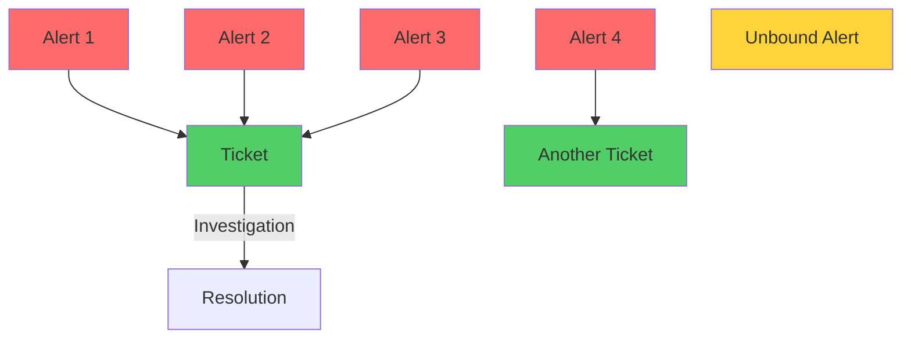
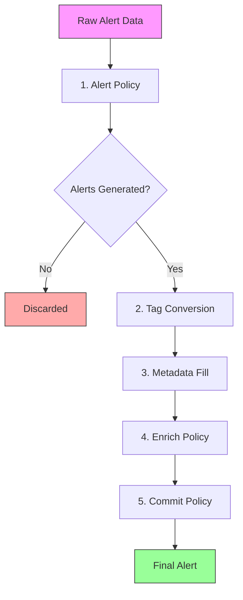
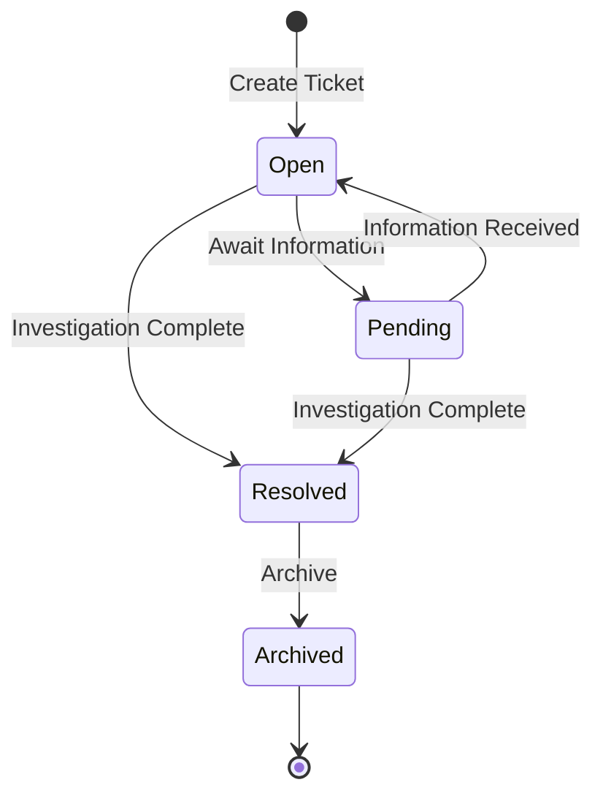
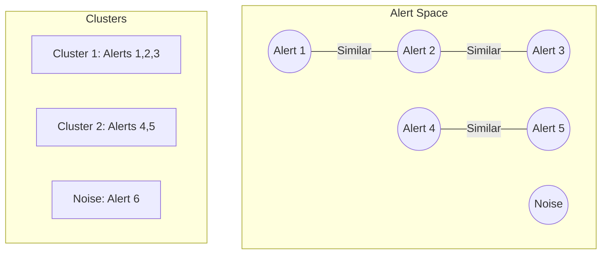

# Warren Data Models

## Core Concepts

Warren operates on two fundamental concepts that work together to manage security incidents:

- **Alert**: An individual security event that requires attention from integrated security devices, monitoring systems and security services.
- **Ticket**: A container for investigating and resolving one or more related alerts

Even when alerts are detected individually, they often represent a single underlying incident. In some cases, this can involve dozens or even hundreds of alerts. Responding to each alert individually would exhaust security analysts.

In Warren, alerts are simply events, and we've defined tickets as the unit for response. Alerts that analysts determine to represent the same incident can be grouped into a ticket later. The system can also list alerts that might be related to a ticket, allowing analysts to filter and bind them as appropriate. This enables analysts to work with appropriate response units.



## Alert Processing Pipeline

Warren processes alerts through a multi-stage pipeline that evaluates policies, enriches data, and determines final disposition.

### Pipeline Stages



### 1. Alert Policy Evaluation

**Purpose**: Transform raw event data into Alert objects

- **Input**: Raw webhook payload (any JSON structure)
- **Output**: Zero or more Alert objects with basic metadata
- **Policy Package**: `package alert.{schema_name}`
- **Behavior if Missing**: Creates default alert with empty metadata

**Key Features**:
- Filter unwanted events
- Generate multiple alerts from single event
- Extract initial attributes
- Define alert schema

### 2. Tag Conversion

**Purpose**: Convert tag names to tag IDs for database storage

- Looks up tag names in `metadata.tags` array
- Creates tags automatically if they don't exist
- Stores tag IDs in alert for efficient filtering

### 3. Metadata Generation

**Purpose**: Fill missing titles and descriptions using LLM

- Only runs if title or description is empty
- Uses Vertex AI Gemini to analyze alert data
- Generates semantic embeddings (768-dim vectors)
- Sets `title_source` and `description_source` to `types.SourceAI`

### 4. Enrich Policy Evaluation

**Purpose**: Execute enrichment tasks using LLM

- **Input**: Processed alert with metadata
- **Output**: Enrichment results (task_id → response mapping)
- **Policy Package**: `package enrich.{schema_name}`
- **Behavior if Missing**: Returns empty results

**Task Types**:
- **Query Tasks**: Simple LLM queries with prompts
- **Agent Tasks**: Complex multi-step LLM operations

**Example Policy**:
```rego
package enrich.security

query contains {
    "id": "analyze_threat",
    "prompt": "Analyze this security event and identify IOCs"
}

agent contains {
    "id": "investigate",
    "prompt": "Investigate the threat using available tools",
    "format": "json"
}
```

### 5. Commit Policy Evaluation

**Purpose**: Apply final metadata and determine publish type

- **Input**: Alert + enrichment results
- **Output**: Commit result with final metadata
- **Policy Package**: `package commit.{schema_name}`
- **Behavior if Missing**: Returns default with `publish = "alert"`

**Output Fields**:
```go
type CommitPolicyResult struct {
    Publish     types.PublishType  // "alert", "notice", or "discard"
    Title       string             // Override alert title
    Description string             // Override alert description
    Channel     string             // Slack channel ID
    Attr        map[string]string  // Additional attributes
}
```

**Publish Types**:
- `"alert"` (default): Full alert processing with ticket creation
- `"notice"`: Simple notification without ticket
- `"discard"`: Drop alert silently

### Event Notification System

The pipeline emits events at each stage for real-time monitoring:

**Event Types**:
- `AlertPolicyResultEvent` - After step 1
- `EnrichPolicyResultEvent` - After step 4
- `CommitPolicyResultEvent` - After step 5
- `EnrichTaskPromptEvent` - Before LLM task execution
- `EnrichTaskResponseEvent` - After LLM task execution
- `ErrorEvent` - On any error

**Notifier Interface**:
```go
type Notifier interface {
    NotifyAlertPolicyResult(ctx, *AlertPolicyResultEvent)
    NotifyEnrichPolicyResult(ctx, *EnrichPolicyResultEvent)
    NotifyCommitPolicyResult(ctx, *CommitPolicyResultEvent)
    NotifyEnrichTaskPrompt(ctx, *EnrichTaskPromptEvent)
    NotifyEnrichTaskResponse(ctx, *EnrichTaskResponseEvent)
    NotifyError(ctx, *ErrorEvent)
}
```

**Implementations**:
- `ConsoleNotifier` - Outputs to console (CLI mode)
- `SlackNotifier` - Posts to Slack thread (real-time collaboration)

### Pipeline Execution

**ProcessAlertPipeline()**: Pure pipeline processing without side effects
- Executes stages 1-5
- Emits events through notifier
- Returns pipeline results
- No database saves, no Slack posts

**HandleAlert()**: Complete alert handling with side effects
- Calls `ProcessAlertPipeline()`
- Handles GenAI processing and Action policies
- Performs similarity search for thread grouping
- Saves to database
- Posts to Slack

### Graceful Degradation

The pipeline continues even when policies are missing:

| Missing Policy | Behavior |
|---------------|----------|
| Alert Policy | Creates default alert with raw data |
| Enrich Policy | Returns empty enrichment results |
| Commit Policy | Uses default publish type ("alert") |

This ensures alerts are never lost due to missing configuration.

## Alert Model

### Structure

An Alert represents a single security event with the following key components:

| Field | Type | Description |
|-------|------|-------------|
| `id` | types.AlertID | Unique identifier (UUID) |
| `ticket_id` | types.TicketID | Associated ticket (can be empty) |
| `schema` | types.AlertSchema | Type of alert (e.g., "guardduty", "custom") |
| `data` | any | Raw alert data from source system |
| `created_at` | time.Time | When the alert was received |
| `slack_thread` | *slack.Thread | Associated Slack conversation |
| `embedding` | firestore.Vector32 | Semantic embedding for similarity (not in JSON) |

**Embedded Fields (from Metadata):**
| Field | Type | Description |
|-------|------|-------------|
| `title` | string | Human-readable title (default: "(no title)") |
| `description` | string | Detailed description (default: "(no description)") |
| `attributes` | []Attribute | Key-value pairs |
| `tags` | []string | Classification tags (e.g., "security", "critical") |
| `title_source` | types.Source | Origin: Human (default), AI, or Inherited |
| `description_source` | types.Source | Origin: Human (default), AI, or Inherited |

### Alert Metadata

Warren automatically enriches alerts with AI-generated metadata:

```go
type Metadata struct {
    Title             string       `json:"title"`
    Description       string       `json:"description"`
    Attributes        []Attribute  `json:"attributes"`
    TitleSource       types.Source `json:"title_source"`
    DescriptionSource types.Source `json:"description_source"`
}
```

**Default Values:**
- Title defaults to `"(no title)"` if empty
- Description defaults to `"(no description)"` if empty
- TitleSource and DescriptionSource default to `types.SourceHuman`

### Alert Attributes

Attributes provide structured information extracted from alerts:

```go
type Attribute struct {
    Key   string  // Attribute name (e.g., "severity", "source_ip")
    Value string  // Attribute value (e.g., "high", "192.168.1.1")
    Link  string  // Optional URL for more information
    Auto  bool    // True if generated by AI
}
```

### Alert States

While alerts themselves are immutable, they have implicit states:

- **Unbound**: Not associated with any ticket (ticket_id is empty)
- **Bound**: Associated with a ticket for investigation
- **Clustered**: Part of an alert cluster (virtual state)

### Embeddings and Similarity

Each alert has a 768-dimensional embedding vector generated by AI from the alert's raw data. This enables:

- **Similarity Search**: Find alerts with similar patterns
- **Clustering**: Automatically group related alerts
- **Deduplication**: Identify duplicate or near-duplicate alerts

## Ticket Model

### Structure

A Ticket represents an investigation container with the following structure:

| Field | Type | Description |
|-------|------|-------------|
| `id` | types.TicketID | Unique identifier |
| `alert_ids` | []types.AlertID | Associated alerts (not in JSON) |
| `slack_thread` | *slack.Thread | Slack conversation |
| `slack_message_id` | string | Slack message identifier |
| `status` | types.TicketStatus | Current status |
| `conclusion` | types.AlertConclusion | Final determination |
| `reason` | string | Explanation for conclusion |
| `finding` | *Finding | Structured investigation results |
| `assignee` | *slack.User | Assigned analyst |
| `created_at` | time.Time | Creation time |
| `updated_at` | time.Time | Last modification |
| `is_test` | bool | Test ticket flag |
| `embedding` | firestore.Vector32 | Semantic embedding (not in JSON) |

**Embedded Fields (from Metadata):**
| Field | Type | Description |
|-------|------|-------------|
| `title` | string | Human-readable title (required) |
| `description` | string | Detailed description (optional) |
| `summary` | string | AI analysis summary (optional) |
| `tags` | []string | Classification tags inherited from alerts |
| `title_source` | types.Source | Origin: AI (default), Human, or Inherited |
| `description_source` | types.Source | Origin: AI (default), Human, or Inherited |

### Ticket Lifecycle



### Ticket Status

- **Open**: Active investigation in progress
- **Pending**: Waiting for additional information or action
- **Resolved**: Investigation completed with conclusion
- **Archived**: Closed and archived for historical reference

### Ticket Conclusions

When resolving a ticket, analysts must select a conclusion:

- **Intended**: Expected behavior, not a security issue
- **Unaffected**: Alert was accurate but system not compromised
- **False Positive**: Alert triggered incorrectly
- **True Positive**: Confirmed security incident
- **Escalated**: Requires higher-level response

### Findings Structure

Tickets can include structured findings:

```go
type Finding struct {
    Severity       types.AlertSeverity `json:"severity"`
    Summary        string              `json:"summary"`
    Reason         string              `json:"reason"`
    Recommendation string              `json:"recommendation"`
}
```

**Note:** The `Finding` struct is defined in both `alert` and `ticket` packages with identical fields, but only tickets actually use it.

## Alert-Ticket Relationships

### One-to-Many Relationship

- **One ticket** can contain **multiple alerts**
- **Each alert** can belong to **at most one ticket**
- Alerts without tickets are considered "unbound"

### Binding Rules

1. An alert can only be bound to one ticket
2. Once bound, alerts cannot be moved to different tickets
3. Multiple alerts can be bound to a ticket at creation or added later
4. Binding is permanent (alerts remain linked even after ticket resolution)

### Metadata Inheritance

When creating tickets from alerts, metadata can be inherited:

1. **Title**: Can use alert title or be customized
2. **Description**: Often combines multiple alert descriptions
3. **Source Tracking**: Maintains whether content is Human, AI, or Inherited

## Alert Clustering

Understanding the relationships between massive volumes of unsorted alerts is an extremely challenging task. The burden of dealing with hundreds or thousands of alerts that suddenly appear due to false positives—even when there's no actual security breach—is self-evident and overwhelming for security teams.

Warren addresses this challenge by implementing alert clustering capabilities, enabling the creation of tickets from clusters and other workflows. This functionality transforms chaos into clarity, allowing analysts to quickly grasp the big picture of what's happening in their environment. By automatically grouping related alerts, Warren helps teams focus on genuine threats rather than drowning in noise.

### DBSCAN Algorithm

Warren uses Density-Based Spatial Clustering (DBSCAN) to group similar alerts. The implementation is located in `pkg/service/clustering/clustering.go`:



### Clustering Parameters

- **eps**: Maximum distance between alerts to be considered similar (0.0-2.0, typically ~0.5)
- **minSamples**: Minimum alerts required to form a cluster (typically 2-5)

### Distance Calculation

Warren uses **cosine distance** on alert embeddings:
- 0.0 = Identical alerts
- 1.0 = Orthogonal (unrelated)
- 2.0 = Opposite meaning

### Cluster Properties

```go
type AlertCluster struct {
    ID            string        // Unique cluster identifier
    CenterAlertID AlertID       // Most representative alert
    AlertIDs      []AlertID     // All alerts in cluster
    Size          int           // Number of alerts
    Keywords      []string      // Common keywords extracted
}
```

### Practical Clustering Use

1. **Alert Storm Management**: Hundreds of similar alerts → Single cluster
2. **Pattern Recognition**: Identify attack campaigns
3. **Noise Reduction**: Isolate outlier alerts
4. **Bulk Operations**: Create tickets from entire clusters

## Embedding System

### Purpose

Embeddings enable semantic understanding of alerts and tickets:

1. **Similarity Search**: Find related incidents
2. **Clustering**: Group similar alerts automatically
3. **Deduplication**: Identify duplicate alerts
4. **Pattern Analysis**: Discover trends and campaigns

### Generation

- **Alerts**: Embeddings generated from the raw `data` field content (not from metadata)
- **Tickets**: Weighted combination:
  - 30% from ticket title/description
  - 70% from associated alert embeddings

### Vector Storage

- 768-dimensional vectors (Vertex AI text-embedding model)
- Stored in Firestore as `firestore.Vector32` type
- Indexed for efficient similarity queries
- Both Alert and Ticket embeddings are excluded from JSON serialization

## Best Practices

### For Alerts

1. **Immutability**: Never modify alert data after creation
2. **Rich Metadata**: Ensure policies extract meaningful attributes
3. **Proper Schemas**: Use consistent schema names for alert types

### For Tickets

1. **Meaningful Titles**: Clear, descriptive titles aid searching
2. **Detailed Findings**: Document investigation thoroughly
3. **Appropriate Conclusions**: Choose conclusions that reflect actual outcomes
4. **Timely Updates**: Keep status current during investigation

### For Clustering

1. **Tune Parameters**: Adjust eps and minSamples for your environment
2. **Regular Review**: Check clusters for patterns and policy improvements
3. **Act on Clusters**: Don't let large clusters accumulate without investigation

## Tags

Tags provide classification for alerts and tickets using string labels (e.g., "security", "critical").

### Tag Properties

- **Name**: String identifier
- **Description**: Optional detailed explanation
- **Color**: Hex color for visual organization
- **Auto-creation**: Tags are created automatically when first referenced

### Tag Assignment

- **Alerts**: Assigned via policies or manual operations
- **Tickets**: Inherit tags from bound alerts, can be modified manually
- **Persistence**: Tag assignments survive tag renaming and metadata changes

### Tag Operations

- **Rename**: Updates name everywhere without breaking associations
- **Delete**: Removes tag from all alerts and tickets
- **Filtering**: Query alerts/tickets by tag presence