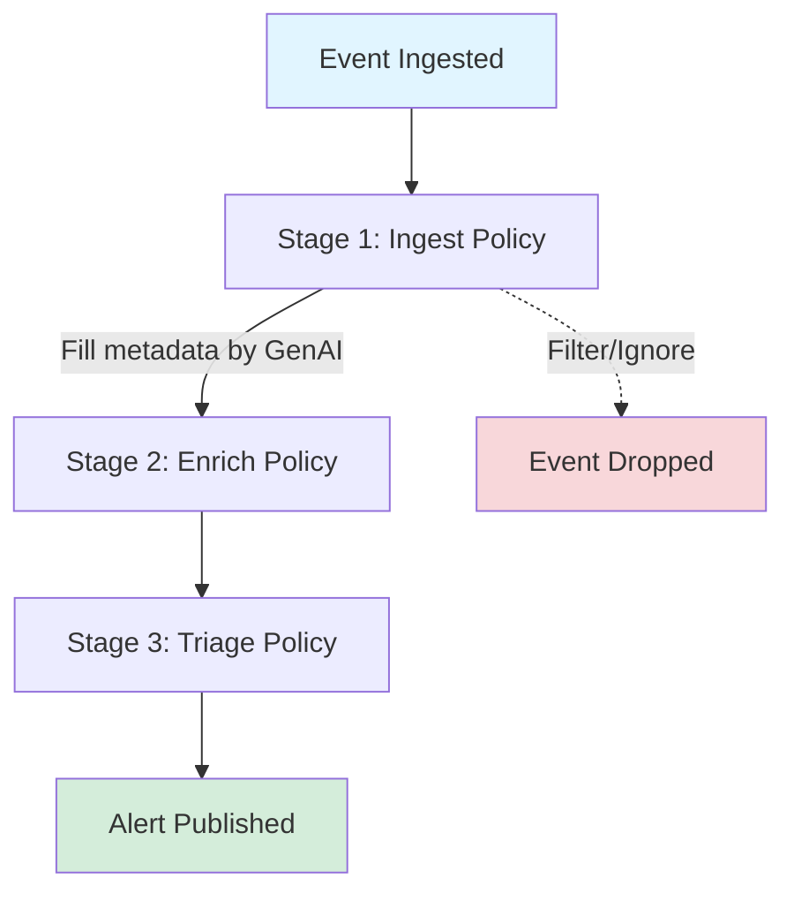

# Policy Guide

Warren uses [Rego](https://www.openpolicyagent.org/docs/latest/policy-language/) policies powered by Open Policy Agent (OPA) to provide flexible and programmable control over alert processing, enrichment, and access control.

## Overview

Warren's policy system enables you to:

- **Transform** incoming security events into structured alerts
- **Enrich** alerts with additional context using AI and external tools
- **Triage** alerts with priority judgment and routing decisions
- **Authorize** API access with flexible authentication rules

## Alert Lifecycle



Key concepts:
1. **Immutability**: Alert data doesn't change after creation. Policies set metadata.
2. **One Event, Multiple Alerts**: Ingest policies can generate multiple alerts from one event.
3. **Three Stages**: Ingest (transform) → Enrich (analyze) → Triage (route)
4. **Graceful Degradation**: Missing policies use defaults — alerts are never lost.

## Policy Types

### Ingest Policy

**Package**: `ingest.{schema_name}`
**When**: First stage — transforms raw events into alerts
**Input**: Raw event data from webhook

```rego
package ingest.guardduty

alerts contains {
    "title": sprintf("%s in %s", [input.detail.type, input.detail.region]),
    "description": input.detail.description,
    "topic": "aws-guardduty",
    "attrs": [
        {"key": "severity", "value": severity_label, "link": ""}
    ]
} if {
    input.source == "aws.guardduty"
    input.detail.severity >= 4.0
}

ignore if {
    input.source == "test"
}

severity_label := "critical" if { input.detail.severity >= 8.0 }
else := "high" if { input.detail.severity >= 6.0 }
else := "medium"
```

Key points:
- `alerts contains` generates alerts (can produce multiple from one event)
- `ignore` filters out unwanted events
- If no policy exists, Warren creates a default alert with AI-generated metadata
- Package name maps to webhook endpoint: `ingest.guardduty` → `/hooks/alert/raw/guardduty`

### Enrich Policy

**Package**: `enrich`
**When**: After alert creation and AI metadata generation
**Input**: Complete alert object with metadata
**Output**: Prompt task definitions

```rego
package enrich

# Prompt with template file
prompts contains {
    "id": "check_ioc",
    "template": "threat_analysis.md",
    "params": {"severity_threshold": "high"},
    "format": "json"
} if {
    input.schema == "guardduty"
}

# Prompt with inline text
prompts contains {
    "id": "investigate_ip",
    "inline": "Investigate the source IP address using available tools",
    "format": "text"
} if {
    has_external_ip
}

has_external_ip if {
    some attr in input.metadata.attributes
    attr.key == "source_ip"
    not startswith(attr.value, "10.")
}
```

Key points:
- All tasks are executed as AI agents with tool access
- Task IDs are optional (auto-generated if omitted)
- Use `template` for files or `inline` for simple prompts
- Format: `"text"` or `"json"` (structured parsing)

### Triage Policy

**Package**: `triage`
**When**: After enrichment tasks complete
**Input**: Alert + enrichment results array
**Output**: Metadata overrides, topic, publish decision

```rego
package triage

get_enrich(task_id) := result if {
    some e in input.enrich
    e.id == task_id
    result := e.result
}

title := sprintf("CONFIRMED THREAT: %s", [input.alert.metadata.title]) if {
    get_enrich("check_ioc").is_malicious == true
}

channel := "security-urgent" if {
    get_enrich("check_ioc").severity == "critical"
}

publish := "discard" if {
    get_enrich("check_ioc").is_false_positive == true
}

# Defaults
channel := "security-alerts"
publish := "alert"
```

Publish types:
- `"alert"` (default): Full alert with ticket creation
- `"notice"`: Simple notification, no ticket
- `"discard"`: Drop the alert silently

### Authorization Policy

#### HTTP API Authorization

**Package**: `auth.http`

```rego
package auth.http

default allow = false

allow if {
    input.iap.email
    endswith(input.iap.email, "@example.com")
}

allow if {
    startswith(input.req.path, "/hooks/alert/")
    input.req.header.Authorization[0] == sprintf("Bearer %s", [input.env.WARREN_WEBHOOK_TOKEN])
}
```

Context available: `input.iap.*`, `input.google.*`, `input.sns.*`, `input.req.*`, `input.env.*`

#### Agent Execution Authorization

**Package**: `auth.agent`

```rego
package auth.agent

allow := true

# Example: Allow only specific Slack users
# allow if { input.auth.slack.id == "U12345678" }
```

Context: `input.message`, `input.env.*`, `input.auth.slack.id`

> **Migration Note**: If you have policies using `package auth`, update to `package auth.http`.

## Getting Started

### 1. Basic Ingest Policy

```rego
package ingest.myservice

alerts contains {
    "title": input.title,
    "description": input.message,
    "attrs": []
} if {
    input.severity != "info"
}
```

Save as `policies/ingest/myservice.rego`, send events to `/hooks/alert/raw/myservice`.

### 2. Add Enrichment

```rego
package enrich

prompts contains {
    "id": "analyze_severity",
    "inline": "Is this a real threat or false positive? JSON: {\"is_threat\": boolean, \"confidence\": number}",
    "format": "json"
} if {
    input.schema == "myservice"
}
```

### 3. Add Triage

```rego
package triage

get_enrich(task_id) := result if {
    some e in input.enrich
    e.id == task_id
    result := e.result
}

channel := "security-urgent" if {
    get_enrich("analyze_severity").is_threat == true
    get_enrich("analyze_severity").confidence > 0.8
}

publish := "discard" if {
    get_enrich("analyze_severity").is_threat == false
    get_enrich("analyze_severity").confidence > 0.9
}

channel := "security-alerts"
publish := "alert"
```

### 4. Test

```bash
warren test \
  --policy ./policies \
  --test-detect-data ./test/myservice/detect \
  --test-ignore-data ./test/myservice/ignore
```

## Policy Sources

Warren can load Rego policies from two kinds of sources, which may be combined. The Rego `package` mechanism merges contributions across sources naturally — partial rules (e.g. `ignore if ...`, `alerts contains ...`) accumulate, while complete rules conflict if they assign different values for the same input.

### File source (default)

Specify one or more local files or directories with `--policy` (or `WARREN_POLICY`). Directories are scanned recursively for `.rego` files. Files are loaded once at startup and never reloaded; restart Warren to pick up changes.

```bash
warren serve --policy ./policies
```

### GitHub source

Set `--policy-github-repo owner/repo` together with GitHub App credentials. Each Warren instance independently fetches the default branch HEAD of the repository and rebuilds its policy client when the commit sha changes. There is no editing UI, push, or PR support yet — this stage only adds a read path.

```bash
warren serve \
  --policy-github-repo myorg/warren-policy \
  --policy-github-path policies \
  --policy-github-app-id 123456 \
  --policy-github-app-installation-id 78901234 \
  --policy-github-app-private-key "$(cat /secrets/warren-policy.pem)"
```

Equivalent environment variables:

```bash
export WARREN_POLICY_GITHUB_REPO=myorg/warren-policy
export WARREN_POLICY_GITHUB_PATH=policies
export WARREN_POLICY_GITHUB_APP_ID=123456
export WARREN_POLICY_GITHUB_APP_INSTALLATION_ID=78901234
export WARREN_POLICY_GITHUB_APP_PRIVATE_KEY="$(cat /secrets/warren-policy.pem)"
```

#### GitHub App setup

Create a dedicated GitHub App with the **minimum** permissions required for read access:

- **Repository permissions**:
  - `Contents`: **Read-only**
  - `Metadata`: **Read-only**
- **Webhook**: not required (Warren polls)
- **Install on**: only the policy repository (not org-wide)

After creation, install the App on your policy repository and capture:
- App ID (Settings → GitHub Apps → your app)
- Installation ID (the `installations/<id>` path segment after install)
- Private key (Settings → GitHub Apps → your app → Generate a private key, downloads `.pem`)

#### Recommended: dedicated GitHub App

If your Warren deployment already uses a GitHub App for tool use (e.g. `pkg/tool/github`), **create a separate App for policy loading** rather than reusing the existing one.

- The tool-use App typically needs read access to many repositories. Reusing it for policy loading would leave the policy repository within a wider blast radius if that App's credentials were ever compromised.
- A dedicated `warren-policy` (or `warren-rule`) App can be installed on **only** the policy repository with `contents: read` + `metadata: read`, and it leaves room to later add a separate write-capable App for editing flows without entangling responsibilities.

### Caching behavior

Each instance caches the GitHub fetch result in memory:

1. Within `--policy-github-cache-ttl` (default `1m`), repeated evaluations reuse the cached compiled policy without contacting GitHub.
2. After the TTL elapses, the next evaluation fetches the default branch HEAD sha. If unchanged, the in-memory policy is reused and only `cachedAt` is refreshed.
3. If the sha differs, file contents are fetched and validated. On success the cache is replaced.
4. If the new fetch or validation fails (network error, invalid Rego, etc.), Warren logs the error and **falls back to the previously cached policy**. The very first fetch has no fallback and will surface as a startup error.

Cache updates are guarded by an in-process mutex so concurrent evaluations in the same instance trigger at most one fetch.

### Combining sources

Specifying both `--policy` and `--policy-github-repo` is supported. Files from both are merged into a single compiled policy. Prefer using distinct Rego file paths between sources to avoid accidental key collisions; the loader reports an error if two sources contribute different content under the same path.

### Multi-instance considerations

Each Warren instance polls GitHub independently with its own `cachedAt`. Within a single TTL window, two instances may briefly serve evaluations against different commit shas (the spread is bounded by the TTL).

## Best Practices

- **Filter early** with `ignore` rules to drop noise before AI processing
- **Request JSON format** for enrichment to enable structured triage decisions
- **Default to alert** — only discard with high confidence
- **Version control** policies in Git
- **Test thoroughly** with both positive and negative scenarios
- **Start simple** and add complexity as needed

## Troubleshooting

- **Policy not loading**: Check `WARREN_POLICY` path, file permissions, and syntax (`opa check policies/`)
- **Enrichment not running**: Verify package is `enrich` (not `enrich.something`)
- **Triage not applying**: Verify package is `triage` and field names match exactly
- **Auth always denied**: Check package is `auth.http` (not `auth`), verify `allow` rules exist

## Resources

- [OPA Documentation](https://www.openpolicyagent.org/docs/latest/)
- [Rego Language Reference](https://www.openpolicyagent.org/docs/latest/policy-reference/)
- [Rego Playground](https://play.openpolicyagent.org/)
