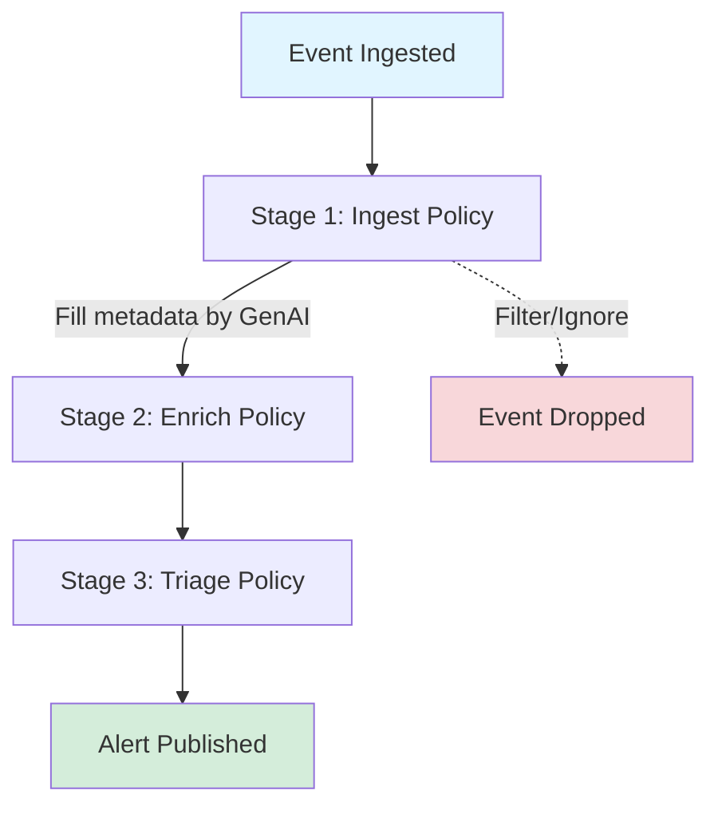

# Policy Guide

Warren uses [Rego](https://www.openpolicyagent.org/docs/latest/policy-language/) policies powered by Open Policy Agent (OPA) to provide flexible and programmable control over alert processing, enrichment, and access control.

## Overview

Warren's policy system enables you to:

- **Transform** incoming security events into structured alerts
- **Enrich** alerts with additional context using AI and external tools
- **Triage** alerts with priority judgment and routing decisions
- **Authorize** API access with flexible authentication rules

## Alert Lifecycle



Key concepts:
1. **Immutability**: Alert data doesn't change after creation. Policies set metadata.
2. **One Event, Multiple Alerts**: Ingest policies can generate multiple alerts from one event.
3. **Three Stages**: Ingest (transform) → Enrich (analyze) → Triage (route)
4. **Graceful Degradation**: Missing policies use defaults — alerts are never lost.

## Policy Types

### Ingest Policy

**Package**: `ingest.{schema_name}`
**When**: First stage — transforms raw events into alerts
**Input**: Raw event data from webhook

```rego
package ingest.guardduty

alerts contains {
    "title": sprintf("%s in %s", [input.detail.type, input.detail.region]),
    "description": input.detail.description,
    "topic": "aws-guardduty",
    "attrs": [
        {"key": "severity", "value": severity_label, "link": ""}
    ]
} if {
    input.source == "aws.guardduty"
    input.detail.severity >= 4.0
}

ignore if {
    input.source == "test"
}

severity_label := "critical" if { input.detail.severity >= 8.0 }
else := "high" if { input.detail.severity >= 6.0 }
else := "medium"
```

Key points:
- `alerts contains` generates alerts (can produce multiple from one event)
- `ignore` filters out unwanted events
- If no policy exists, Warren creates a default alert with AI-generated metadata
- Package name maps to webhook endpoint: `ingest.guardduty` → `/hooks/alert/raw/guardduty`

### Enrich Policy

**Package**: `enrich`
**When**: After alert creation and AI metadata generation
**Input**: Complete alert object with metadata
**Output**: Prompt task definitions

```rego
package enrich

# Prompt with template file
prompts contains {
    "id": "check_ioc",
    "template": "threat_analysis.md",
    "params": {"severity_threshold": "high"},
    "format": "json"
} if {
    input.schema == "guardduty"
}

# Prompt with inline text
prompts contains {
    "id": "investigate_ip",
    "inline": "Investigate the source IP address using available tools",
    "format": "text"
} if {
    has_external_ip
}

has_external_ip if {
    some attr in input.metadata.attributes
    attr.key == "source_ip"
    not startswith(attr.value, "10.")
}
```

Key points:
- All tasks are executed as AI agents with tool access
- Task IDs are optional (auto-generated if omitted)
- Use `template` for files or `inline` for simple prompts
- Format: `"text"` or `"json"` (structured parsing)

### Triage Policy

**Package**: `triage`
**When**: After enrichment tasks complete
**Input**: Alert + enrichment results array
**Output**: Metadata overrides, topic, publish decision

```rego
package triage

get_enrich(task_id) := result if {
    some e in input.enrich
    e.id == task_id
    result := e.result
}

title := sprintf("CONFIRMED THREAT: %s", [input.alert.metadata.title]) if {
    get_enrich("check_ioc").is_malicious == true
}

channel := "security-urgent" if {
    get_enrich("check_ioc").severity == "critical"
}

publish := "discard" if {
    get_enrich("check_ioc").is_false_positive == true
}

# Defaults
channel := "security-alerts"
publish := "alert"
```

Publish types:
- `"alert"` (default): Full alert with ticket creation
- `"notice"`: Simple notification, no ticket
- `"discard"`: Drop the alert silently

### Authorization Policy

#### HTTP API Authorization

**Package**: `auth.http`

```rego
package auth.http

default allow = false

allow if {
    input.iap.email
    endswith(input.iap.email, "@example.com")
}

allow if {
    startswith(input.req.path, "/hooks/alert/")
    input.req.header.Authorization[0] == sprintf("Bearer %s", [input.env.WARREN_WEBHOOK_TOKEN])
}
```

Context available: `input.iap.*`, `input.google.*`, `input.sns.*`, `input.req.*`, `input.env.*`

#### Agent Execution Authorization

**Package**: `auth.agent`

```rego
package auth.agent

allow := true

# Example: Allow only specific Slack users
# allow if { input.auth.slack.id == "U12345678" }
```

Context: `input.message`, `input.env.*`, `input.auth.slack.id`

> **Migration Note**: If you have policies using `package auth`, update to `package auth.http`.

## Getting Started

### 1. Basic Ingest Policy

```rego
package ingest.myservice

alerts contains {
    "title": input.title,
    "description": input.message,
    "attrs": []
} if {
    input.severity != "info"
}
```

Save as `policies/ingest/myservice.rego`, send events to `/hooks/alert/raw/myservice`.

### 2. Add Enrichment

```rego
package enrich

prompts contains {
    "id": "analyze_severity",
    "inline": "Is this a real threat or false positive? JSON: {\"is_threat\": boolean, \"confidence\": number}",
    "format": "json"
} if {
    input.schema == "myservice"
}
```

### 3. Add Triage

```rego
package triage

get_enrich(task_id) := result if {
    some e in input.enrich
    e.id == task_id
    result := e.result
}

channel := "security-urgent" if {
    get_enrich("analyze_severity").is_threat == true
    get_enrich("analyze_severity").confidence > 0.8
}

publish := "discard" if {
    get_enrich("analyze_severity").is_threat == false
    get_enrich("analyze_severity").confidence > 0.9
}

channel := "security-alerts"
publish := "alert"
```

### 4. Test

```bash
warren test \
  --policy ./policies \
  --test-detect-data ./test/myservice/detect \
  --test-ignore-data ./test/myservice/ignore
```

## Best Practices

- **Filter early** with `ignore` rules to drop noise before AI processing
- **Request JSON format** for enrichment to enable structured triage decisions
- **Default to alert** — only discard with high confidence
- **Version control** policies in Git
- **Test thoroughly** with both positive and negative scenarios
- **Start simple** and add complexity as needed

## Troubleshooting

- **Policy not loading**: Check `WARREN_POLICY` path, file permissions, and syntax (`opa check policies/`)
- **Enrichment not running**: Verify package is `enrich` (not `enrich.something`)
- **Triage not applying**: Verify package is `triage` and field names match exactly
- **Auth always denied**: Check package is `auth.http` (not `auth`), verify `allow` rules exist

## Resources

- [OPA Documentation](https://www.openpolicyagent.org/docs/latest/)
- [Rego Language Reference](https://www.openpolicyagent.org/docs/latest/policy-reference/)
- [Rego Playground](https://play.openpolicyagent.org/)
