# Warren Policy Guide

Warren uses [Rego](https://www.openpolicyagent.org/docs/latest/policy-language/) policies powered by Open Policy Agent (OPA) to provide flexible and programmable control over alert processing, enrichment, and access control.

## Table of Contents

- [Overview](#overview)
- [Alert Lifecycle](#alert-lifecycle)
- [Policy Types](#policy-types)
  - [Ingest Policy](#ingest-policy)
  - [Enrich Policy](#enrich-policy)
  - [Triage Policy](#triage-policy)
  - [Authorization Policy](#authorization-policy)
- [Pipeline Architecture](#pipeline-architecture)
- [Getting Started](#getting-started)
- [Best Practices](#best-practices)
- [Examples](#examples)

## Overview

Warren's policy system enables you to:

- **Transform** incoming security events into structured alerts
- **Enrich** alerts with additional context using AI and external tools
- **Triage** alerts with priority judgment and routing decisions
- **Authorize** API access with flexible authentication rules

All policies are written in Rego, a declarative language designed for expressing complex policy logic. Warren evaluates these policies at different stages of the alert processing pipeline.

## Alert Lifecycle

An alert in Warren goes through several stages from ingestion to notification:

```mermaid
flowchart TD
    A[Event Ingested] --> B[Stage 1: Ingest Policy]
    B -->|Fill metadata by GenAI| D[Stage 2: Enrich Policy]
    D --> E[Stage 3: Triage Policy]
    E --> F[Alert Published]

    B -.->|Filter/Ignore| G[Event Dropped]

    subgraph B_box [" "]
        B
        B_desc["• Transforms raw event into Alert objects<br/>• Can filter/ignore events<br/>• Can generate multiple alerts from one event<br/>• Sets initial metadata (title, description, attrs)"]
    end

    subgraph D_box [" "]
        D
        D_desc["• Defines enrichment tasks (query/agent)<br/>• Tasks can query LLM or use AI agents with tools<br/>• Results stored in task ID map"]
    end

    subgraph E_box [" "]
        E
        E_desc["• Has access to alert + enrichment results<br/>• Can override metadata based on enrichment<br/>• Determines publish type (alert/notice/discard)<br/>• Sets final routing (channel)"]
    end

    style A fill:#e1f5ff
    style F fill:#d4edda
    style G fill:#f8d7da
    style B fill:#fff3cd
    style D fill:#d1ecf1
    style E fill:#d4f1d4
    style B_box fill:#fffef0
    style D_box fill:#f0f8ff
    style E_box fill:#f0fff0
```



### Key Lifecycle Concepts

1. **Immutability**: Once an alert is created, its core data doesn't change. Policies can set metadata, but the original event data remains intact.

2. **One Event, Multiple Alerts**: Ingest policies can generate multiple alerts from a single event (e.g., processing an array of findings).

3. **Three Policy Stages**:
   - **Ingest Policy**: Transforms raw events into alerts, filters unwanted events
   - **Enrich Policy**: Defines additional AI analysis tasks (query/agent)
   - **Triage Policy**: Makes final routing and publishing decisions based on enrichment results

4. **Progressive Enhancement**: Each policy stage adds more context:
   - Ingest policy: Initial structure and filtering
   - Enrich policy: Additional investigation tasks
   - Triage policy: Final decision and routing

> **Note**: Warren automatically fills missing titles/descriptions with AI between Ingest and Enrich policies. This is not controlled by policies.

## Policy Types

Warren uses four types of policies, each evaluated at different stages of the pipeline:

### Ingest Policy

**Package**: `ingest.{schema_name}`
**When**: First stage - transforms raw events into alerts
**Input**: Raw event data from webhook
**Output**: Alert metadata (title, description, attributes)

Ingest policies define how external events become Warren alerts. The package name determines the webhook endpoint:

- Package `ingest.guardduty` → Endpoint `/hooks/alert/raw/guardduty`
- Package `ingest.custom` → Endpoint `/hooks/alert/raw/custom`

**Structure**:

```rego
package ingest.{schema_name}

# Main rule - can generate multiple alerts
alerts contains {
    "title": "Alert title",
    "description": "Alert description",
    "attrs": [
        {
            "key": "severity",
            "value": "high",
            "link": ""
        }
    ]
} if {
    # Conditions for alert creation
    input.severity >= 5
    not ignore
}

# Optional ignore rule for filtering
ignore if {
    input.source == "test"
}
```

**Key Points**:

- Use `alerts contains` to generate alerts (can produce multiple from one event)
- Use `ignore` to filter out unwanted events
- If no policy exists, Warren creates a default alert and uses AI for metadata
- Attributes can include links to external tools (VirusTotal, IPinfo, etc.)

### Enrich Policy

**Package**: `enrich`
**When**: After alert creation and AI metadata generation
**Input**: Complete alert object with metadata
**Output**: Prompt task definitions

Enrich policies define additional analysis to perform on alerts using AI:

**Structure**:

```rego
package enrich

# Prompt tasks with template files
prompts contains {
    "id": "check_ioc",
    "template": "threat_analysis.md",  # Template file path
    "params": {
        "severity_threshold": "high",
        "include_context": true
    },
    "format": "json"  # or "text"
} if {
    input.schema == "guardduty"
}

# Prompt tasks with inline text
prompts contains {
    "id": "investigate_ip",
    "inline": "Investigate the source IP address",  # Inline prompt
    "format": "text"
} if {
    has_external_ip
}

# ID is optional - auto-generated if omitted
prompts contains {
    "inline": "Quick security check",  # ID will be auto-generated
    "format": "text"
} if {
    input.schema == "vpc_flow"
}

has_external_ip if {
    some attr in input.metadata.attributes
    attr.key == "source_ip"
    not startswith(attr.value, "10.")
}
```

**Key Points**:

- All tasks are executed as AI agents with tool access (using `gollem.Agent`)
- Task IDs are **optional** - if omitted, a unique ID is auto-generated (e.g., `task_a1b2c3d4`)
- Task IDs are used to reference results in triage policy
- Use `template` for template files (supports `text/template` syntax)
- Use `params` to pass custom parameters to templates
- Use `inline` for simple inline prompts
- Format can be `"text"` or `"json"` (JSON enables structured parsing)
- All tasks have access to tools configured in Warren

### Triage Policy

**Package**: `triage`
**When**: After enrichment tasks complete
**Input**: Alert object + enrichment results array
**Output**: Final metadata overrides and publish decision

Triage policies make final decisions about alert handling based on original alert data and enrichment results:

**Structure**:

```rego
package triage

# Helper function to get enrichment result by ID
get_enrich(task_id) := result if {
    some e in input.enrich
    e.id == task_id
    result := e.result
}

# Override title based on enrichment
title := sprintf("CONFIRMED THREAT: %s", [input.alert.metadata.title]) if {
    get_enrich("check_ioc").is_malicious == true
}

# Override description
description := get_enrich("check_ioc").analysis if {
    get_enrich("check_ioc").analysis
}

# Set notification channel
channel := "security-urgent" if {
    get_enrich("check_ioc").severity == "critical"
}

# Add attributes from enrichment
attr contains {
    "key": "threat_score",
    "value": get_enrich("check_ioc").score,
    "link": ""
} if {
    get_enrich("check_ioc").score
}

# Determine publish type
publish := "discard" if {
    get_enrich("check_ioc").is_false_positive == true
}

publish := "notice" if {
    input.alert.metadata.severity == "low"
}

# Default: publish as full alert
publish := "alert"
```

**Publish Types**:

- `"alert"` (default): Full alert with ticket creation and Slack thread
- `"notice"`: Simple notification only, no ticket
- `"discard"`: Drop the alert, no notification

**Input Structure**:

```json
{
  "alert": {
    "id": "alert-123",
    "schema": "guardduty",
    "metadata": {
      "title": "Alert title",
      "description": "Alert description",
      "attributes": [...]
    },
    "data": { /* original event */ }
  },
  "enrich": [
    {
      "id": "check_ioc",
      "prompt": "Analyze this security alert...",
      "result": {
        "is_malicious": true,
        "score": "8.5",
        "analysis": "..."
      }
    },
    {
      "id": "investigate_ip",
      "prompt": "Investigate the source IP address",
      "result": "IP is associated with known botnet"
    }
  ]
}
```

**Key Points**:

- Enrichment results are in array format: `input.enrich[]`
- Each result has `id`, `prompt` (used prompt text), and `result` (task output)
- Use helper functions like `get_enrich(task_id)` to access specific results
- Can override any metadata field
- Use `publish` to control alert disposition
- Default behavior is to publish as full alert

### Authorization Policy

Warren provides two types of authorization policies to control access:

#### HTTP API Authorization

**Package**: `auth.http`
**When**: On every HTTP API request
**Input**: Request context (IAP, Google ID, SNS, headers, env)
**Output**: `allow = true` or `false`

HTTP authorization policies control access to Warren's API endpoints:

**Structure**:

```rego
package auth.http

default allow = false

# Allow authenticated users from company domain
allow if {
    input.iap.email
    endswith(input.iap.email, "@example.com")
}

# Allow service accounts
allow if {
    input.google.email == "monitoring@project.iam.gserviceaccount.com"
}

# Allow webhook with token
allow if {
    startswith(input.req.path, "/hooks/alert/")
    input.req.header.Authorization[0] == sprintf("Bearer %s", [input.env.WARREN_WEBHOOK_TOKEN])
}
```

**Context Available**:

- `input.iap.*`: Google IAP JWT claims
- `input.google.*`: Google ID token claims
- `input.sns.*`: AWS SNS message data
- `input.req.*`: HTTP request details (method, path, headers, body)
- `input.env.*`: All environment variables

#### Agent Execution Authorization

**Package**: `auth.agent`
**When**: Before executing AI agent (Slack chat, CLI chat)
**Input**: Message text, environment variables, authenticated subject
**Output**: `allow = true` or `false`

Agent authorization policies control who can execute AI agent investigations through Slack mentions or CLI:

**Structure**:

```rego
package auth.agent

# Default policy: Allow all agent execution requests
allow := true

# Example 1: Allow only specific Slack users
# allow {
#     input.auth.slack.id == "U12345678"
# }

# Example 2: Allow based on environment variable
# allow {
#     input.env.WARREN_AGENT_AUTH_MODE == "permissive"
# }

# Example 3: Deny specific commands
# allow {
#     not contains(input.message, "dangerous_command")
# }
```

**Input Structure**:

```json
{
  "message": "User's message to the agent",
  "env": {
    "WARREN_ENV_VAR": "value",
    ...
  },
  "auth": {
    "slack": {
      "id": "U12345678"
    }
  }
}
```

**Context Available**:

- `input.message`: The message text sent to the agent
- `input.env.*`: All environment variables
- `input.auth.slack`: Slack authentication information (if available)
  - `id`: Slack user ID

**Security Model**:

Agent authorization follows a **deny-by-default** model:
- If no policy is defined, all agent execution requests are **denied**
- If policy evaluation fails, the request is **denied**
- Only explicit `allow = true` permits agent execution

**Key Points**:

- Agent authorization is evaluated at the start of the `Chat()` usecase
- On denial, user receives: "🚫 You are not authorized to execute this agent request."
- Policy is optional - set `WARREN_POLICY` to enable
- If policy client is not configured, agent execution is allowed (backward compatibility)

**Migration Note**:

If you have existing authorization policies using `package auth`, you must update them to `package auth.http` for HTTP API authorization. The `auth` package name is no longer supported.

## Pipeline Architecture

Warren's alert processing pipeline is implemented in `pkg/usecase/alert_pipeline.go`:


**Event Notifications**:

The pipeline emits events through the `Notifier` interface for real-time monitoring:

- `NotifyIngestPolicyResult`: Ingest policy evaluation complete
- `NotifyEnrichPolicyResult`: Enrich policy evaluation complete
- `NotifyEnrichTaskPrompt`: Enrichment task prompt being sent
- `NotifyEnrichTaskResponse`: Enrichment task response received
- `NotifyTriagePolicyResult`: Triage policy evaluation complete
- `NotifyError`: Error occurred during processing

These events power:
- Console output (colored, formatted logs)
- Slack thread updates (real-time pipeline progress)
- Debugging and observability

**Pure Pipeline vs. Full Handling**:

- `ProcessAlertPipeline()`: Pure function, no side effects (no DB, no Slack)
- `HandleAlert()`: Complete handling including DB save and Slack posting

This separation enables testing and reusability.

## Getting Started

### 1. Basic Ingest Policy

Start with a simple ingest policy that passes events through:

```rego
package ingest.myservice

alert contains {
    "title": input.title,
    "description": input.message,
    "attrs": []
} if {
    input.severity != "info"
}
```

Save as `policies/ingest/myservice.rego` and send events to `/hooks/alert/raw/myservice`.

### 2. Add AI Enrichment

Define enrichment tasks for additional analysis:

```rego
package enrich

query contains {
    "id": "analyze_severity",
    "inline": "Based on the alert data, is this a true security threat or false positive? Respond with JSON: {\"is_threat\": boolean, \"confidence\": number, \"reasoning\": string}",
    "format": "json"
} if {
    input.schema == "myservice"
}
```

Save as `policies/enrich/enrich.rego`.

### 3. Make Triage Decisions

Use triage policy to route based on enrichment:

```rego
package triage

# Route high-confidence threats to urgent channel
channel := "security-urgent" if {
    input.enrich.analyze_severity.is_threat == true
    input.enrich.analyze_severity.confidence > 0.8
}

# Discard confirmed false positives
publish := "discard" if {
    input.enrich.analyze_severity.is_threat == false
    input.enrich.analyze_severity.confidence > 0.9
}

# Default to normal channel
channel := "security-alerts"
publish := "alert"
```

Save as `policies/triage/triage.rego`.

### 4. Test Your Policies

Create test data and verify behavior:

```bash
warren test \
  --policy ./policies \
  --test-detect-data ./test/myservice/detect \
  --test-ignore-data ./test/myservice/ignore
```

## Best Practices

### Ingest Policy Best Practices

1. **Filter Early**: Use `ignore` rules to drop noise before AI processing
2. **Structured Attributes**: Extract key fields as attributes for filtering/clustering
3. **Useful Links**: Add links to external tools (VirusTotal, IPinfo, AWS Console)
4. **Handle Arrays**: Use `event := input.Records[_]` pattern for batch events
5. **Validate Input**: Check required fields exist before accessing them

### Enrich Policy Best Practices

1. **Use Query for Simple Tasks**: Query tasks are faster than agents
2. **Request JSON Format**: Structured responses are easier to parse in triage policy
3. **Limit Agent Tasks**: Agents are powerful but slower - use sparingly
4. **Descriptive Task IDs**: Use meaningful IDs like `check_threat_intel`, not `task1`
5. **Conditional Enrichment**: Only run tasks when relevant (check alert schema/attributes)

### Triage Policy Best Practices

1. **Default to Alert**: Always provide default `publish = "alert"` and `channel`
2. **Conservative Discarding**: Only discard with high confidence
3. **Preserve Context**: When overriding title/description, include original context
4. **Use Enrichment Wisely**: Don't blindly trust AI - validate confidence scores
5. **Test Edge Cases**: Verify behavior when enrichment tasks fail or return unexpected data

### General Policy Best Practices

1. **Version Control**: Store policies in Git
2. **Test Thoroughly**: Create test cases for both positive and negative scenarios
3. **Document Decisions**: Comment why certain rules exist
4. **Monitor Performance**: Watch for slow policies in logs
5. **Iterate Gradually**: Start simple, add complexity as needed

## Examples

### Complete GuardDuty Pipeline

**Ingest Policy** (`policies/ingest/guardduty.rego`):

```rego
package ingest.guardduty

alerts contains {
    "title": sprintf("%s in %s", [input.detail.type, input.detail.region]),
    "description": input.detail.description,
    "attrs": [
        {
            "key": "severity",
            "value": severity_label,
            "link": ""
        },
        {
            "key": "account",
            "value": input.detail.accountId,
            "link": ""
        },
        {
            "key": "finding_id",
            "value": input.detail.id,
            "link": sprintf("https://console.aws.amazon.com/guardduty/home?region=%s#/findings?search=id%%3D%s", [
                input.detail.region,
                input.detail.id
            ])
        }
    ]
} if {
    input.source == "aws.guardduty"
    input.detail.severity >= 4.0  # Medium and above
}

severity_label := "critical" if { input.detail.severity >= 8.0 }
else := "high" if { input.detail.severity >= 6.0 }
else := "medium"
```

**Enrich Policy** (`policies/enrich/enrich.rego`):

```rego
package enrich

# Analyze GuardDuty findings with AI
prompts contains {
    "id": "analyze_finding",
    "inline": "Analyze this GuardDuty finding. Provide: 1) Is this a real threat or false positive? 2) Recommended actions. 3) Urgency level. Respond in JSON: {\"is_threat\": boolean, \"confidence\": number, \"actions\": string[], \"urgency\": string}",
    "format": "json"
} if {
    input.schema == "guardduty"
}

# Use agent to investigate external IPs
prompts contains {
    "id": "investigate_ip",
    "inline": "Investigate the remote IP address in this GuardDuty finding using available threat intelligence tools. Summarize your findings.",
    "format": "text"
} if {
    input.schema == "guardduty"
    has_remote_ip
}

has_remote_ip if {
    some attr in input.metadata.attributes
    attr.key == "remote_ip"
}
```

**Triage Policy** (`policies/triage/triage.rego`):

```rego
package triage

# Helper function to get enrichment result
get_enrich(task_id) := result if {
    some e in input.enrich
    e.id == task_id
    result := e.result
}

# Override title for confirmed threats
title := sprintf("🚨 CONFIRMED THREAT: %s", [input.alert.metadata.title]) if {
    get_enrich("analyze_finding").is_threat == true
    get_enrich("analyze_finding").confidence > 0.85
}

# Add threat intelligence findings
attr contains {
    "key": "threat_intel",
    "value": get_enrich("investigate_ip"),
    "link": ""
} if {
    get_enrich("investigate_ip")
}

# Route based on urgency
channel := "security-critical" if {
    get_enrich("analyze_finding").urgency == "critical"
}

channel := "security-urgent" if {
    get_enrich("analyze_finding").urgency == "high"
}

# Discard false positives
publish := "discard" if {
    get_enrich("analyze_finding").is_threat == false
    get_enrich("analyze_finding").confidence > 0.9
}

# Default routing
channel := "security-alerts"
publish := "alert"
```

### Severity-Based Routing

Simple triage policy for routing by severity:

```rego
package triage

channel := "security-critical" if {
    input.alert.metadata.severity == "critical"
}

channel := "security-high" if {
    input.alert.metadata.severity == "high"
}

# Send low severity as notices only
publish := "notice" if {
    input.alert.metadata.severity == "low"
}

channel := "security-info" if {
    input.alert.metadata.severity == "low"
}

# Default
channel := "security-alerts"
publish := "alert"
```

## Additional Resources

- [Open Policy Agent Documentation](https://www.openpolicyagent.org/docs/latest/)
- [Rego Language Reference](https://www.openpolicyagent.org/docs/latest/policy-reference/)
- [Rego Playground](https://play.openpolicyagent.org/) - Test policies online
- [Warren GitHub Repository](https://github.com/secmon-lab/warren) - Source code and examples

## Troubleshooting

### Policy Not Loading

**Symptoms**: Warren starts but policies don't seem to be evaluated

**Solutions**:
1. Check `WARREN_POLICY` environment variable points to policy directory
2. Verify file permissions (policies must be readable)
3. Check syntax: `opa check policies/`
4. Look for errors in Warren startup logs

### Enrichment Tasks Not Running

**Symptoms**: Triage policy receives empty `input.enrich`

**Solutions**:
1. Verify enrich policy package is exactly `enrich` (not `enrich.something`)
2. Check task conditions - they may not match your alert
3. Ensure `WARREN_LLM_*` environment variables are set
4. Check Warren logs for task execution errors

### Triage Policy Not Applying

**Symptoms**: Alert metadata doesn't reflect triage policy changes

**Solutions**:
1. Verify triage policy package is exactly `triage`
2. Check that field names match exactly (`title`, `description`, `channel`, `attr`, `publish`)
3. Use `print()` statements to debug: `print("Setting channel:", channel)`
4. Verify enrichment task IDs match: `input.enrich.{task_id}`

### Authorization Always Denied

**Symptoms**: API requests fail with 403 Forbidden, or agent execution is blocked

**Solutions**:

For **HTTP API Authorization**:
1. Check auth policy package is exactly `auth.http` (not `auth` or `auth.api`)
2. Verify `default allow = false` has at least one `allow if` rule
3. Debug context: Add `print("Auth input:", input)` to see what's available
4. Start permissive: `allow = true` temporarily to test (remove in production!)
5. Check that `WARREN_NO_AUTHORIZATION` flag is NOT set (removes auth entirely)

For **Agent Authorization**:
1. Check policy package is exactly `auth.agent`
2. Verify at least one `allow` rule matches your use case
3. Remember: deny-by-default - policy must explicitly allow
4. For testing: Use simple `allow = true` to verify policy is loading
5. Check Slack user ID in context: Add `print("Agent auth input:", input)` to debug
6. Verify Slack user info is available at `input.auth.slack.id` (not `input.authctx.slack_user.id`)

**Common Migration Issue**:

If you recently upgraded and API requests are failing:
- Old: `package auth`
- New: `package auth.http`

Update your policy file's package declaration to fix this.

For more detailed troubleshooting and examples, see the sections in the original policy documentation.
